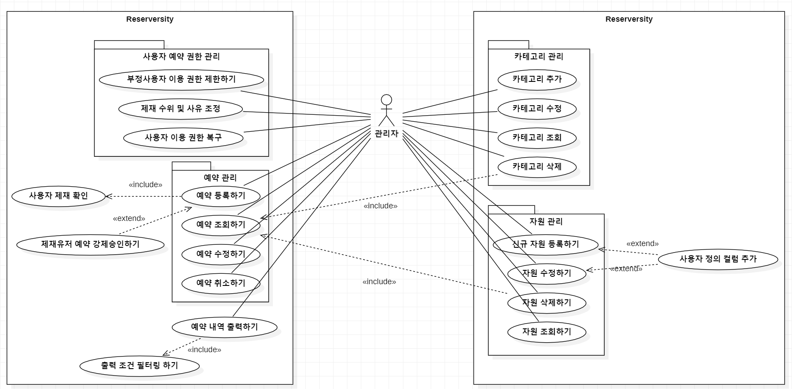

# Analysis Reserversity
[ Student No ] 22212034  
[ name ] 최승표  
[ email ] cspcsp07@naver.com

---

### [ Revision history ]
| Revision date | Version # | Description | Author |
| :---: | :---: | :---: | :---: |
| 2026.04.28 | 0.0.1 | First Document | 최승표 |
| 2026.05.04 | 0.0.2 | 명세서 구체화 | 최승표 |

## [ Contents ]
1. Introduction
2. Use case analysis
3. Domain analysis
4. User Interface Prototype
5. Glossary
6. References

## 1. Intorduction
본 문서에서는 통합 관리 프로그램인 'Reserversity' 프로젝트의 시스템이 "무엇을" 하고자 하는지를 담고있습니다.

1.1 목적(Purpose)
- 본 문서는 영남대학교 'Reserversity'의 요구사항을 분석하고, 시스템 서례를 위한 기술적 토대를 마련하는 것을 목적으로 한다.
- 사용자 인터페이스(Actor)와 시스템 내부 로직 간의 상호작용을 명확히 정의하여 개발 단계에서의 오류를 최소화 하고자 한다.

## 2. Use case analysis

### Use Case Diagram

  
  
<em>&lt;그림 1&gt; Use Case Diagram</em>

### Use Case #1-1 : 카테고리 추가

| GENERAL CHARACTERISTICS | |
| :--- | :--- |
| **Summary** | 자원의 효율적인 분류를 위해 새로운 관리 범주를 생성하는 기능 |
| **Scope** | Reserversity |
| **Level** | User level |
| **Author** | 최승표 |
| **Last Update** | 2026.05.03 |
| **Status** | Analysis (Finalize) |
| **Primary Actor** | 관리자 |
| **Preconditions** | 관리자가 프로그램(Reserversity)을 실행하여 대시보드(메인 화면)에 진입한 상태여야 함 |
| **Trigger** | 새로운 자원 분류 체계가 필요하여 '+ 카테고리 추가' 버튼을 클릭할 때 |
| **Success Post Condition** | 새로운 카테고리 정보가 DB의 Category 테이블에 저장되어 자원 등록 시 선택 가능해짐 |
| **Failed Post Condition** | 중복된 이름이거나 오류 발생 시 데이터가 저장되지 않음 |

 

| MAIN SUCCESS SCENARIO | |
| :--- | :--- |
| **Step** | **Action** |
| **S** | 관리자가 대시보드에서 새로운 자원 카테고리를 등록한다. |
| **1** | 관리자가 대시보드 메인 화면 우측 상단의 '+ 카테고리 추가' 버튼을 클릭한다. |
| **2** | 시스템이 카테고리 추가 모달(팝업) 창을 띄우고, 관리자는 카테고리 명칭과 설명을 입력한 뒤 '저장' 버튼을 누른다. |
| **3** | 시스템은 명칭 중복 여부를 검증한 후 내부 DB(Category 테이블)에 데이터를 반영한다. |
| **4** | 추가 창이 닫히고, 대시보드의 카테고리 목록 현황표에 새로 추가된 항목이 즉시 출력되며 종료된다. |

 

| EXTENSION SCENARIOS | |
| :--- | :--- |
| **Step** | **Branching Action** |
| **2** | 2a. 관리자가 정보 입력 중 '취소' 버튼을 누르거나 창을 닫는다.   ...2a1. 시스템은 입력 중이던 데이터를 파기한다.   ...2a2. 창이 닫히고 원래의 대시보드 상태로 돌아가며 프로세스가 종료된다. |
| **3** | 3a. 이미 존재하는 카테고리 명칭을 입력하여 처리에 실패한다.   ...3a1. "이미 존재하는 카테고리명입니다"라는 경고 메시지를 보여준다.   ...3a2. 관리자가 명칭을 수정하는 단계(Step 2)로 돌아간다. |
| **3** | 3b. 데이터베이스 연결 오류로 인해 저장이 실패한다.   ...3b1. "시스템 오류로 저장에 실패했습니다"라는 메시지를 출력한다.   ...3b2. 관리자가 잠시 후 다시 시도할 수 있도록 안내한다. |

 

| RELATED INFORMATION | |
| :--- | :--- |
| **Performance** | ≤ 1 second |
| **Frequency** | 신규 자원 분류 체계 필요 시 발생 (월평균 1~2회 미만) |
| **\<Concurrency>** | 제한 없음 |
| **Due Date** | 2026. 05. 08. |

---

### Use Case #1-2 : 카테고리 수정

| GENERAL CHARACTERISTICS | |
| :--- | :--- |
| **Summary** | 등록된 자원 카테고리의 정보(명칭, 설명 등)를 필요에 따라 변경하는 기능 |
| **Scope** | Reserversity |
| **Level** | User level |
| **Author** | 최승표 |
| **Last Update** | 2026.05.03 |
| **Status** | Analysis (Finalize) |
| **Primary Actor** | 관리자 |
| **Preconditions** | 관리자가 프로그램(Reserversity)을 실행하여 대시보드(메인 화면)에 진입한 상태이며, 시스템에 1개 이상의 카테고리가 등록되어 있어야 함 |
| **Trigger** | 기존 카테고리의 명칭이나 설명을 변경하기 위해 해당 카테고리의 '수정' 아이콘(버튼)을 클릭할 때 |
| **Success Post Condition** | 수정된 정보가 DB의 Category 테이블에 업데이트되고 변경 사항이 화면에 즉시 반영됨 |
| **Failed Post Condition** | 중복된 이름이거나 오류 발생 시 데이터가 변경되지 않고 기존 상태를 유지함 |

 

| MAIN SUCCESS SCENARIO | |
| :--- | :--- |
| **Step** | **Action** |
| **S** | 관리자가 대시보드에서 기존 자원 카테고리의 정보를 수정한다. |
| **1** | 관리자가 대시보드의 카테고리 목록에서 수정하고자 하는 항목의 '수정' 버튼을 클릭한다. |
| **2** | 시스템이 기존 카테고리 정보가 미리 채워진(Pre-filled) 수정 모달(팝업) 창을 띄운다. |
| **3** | 관리자가 카테고리 명칭이나 설명을 변경한 뒤 '저장' 버튼을 누른다. |
| **4** | 시스템은 수정한 명칭이 다른 카테고리와 중복되는지 검증한 후, 내부 DB(Category 테이블)의 데이터를 업데이트한다. |
| **5** | 수정 창이 닫히고, 대시보드의 카테고리 목록에 변경된 정보가 즉시 반영되며 종료된다. |

 

| EXTENSION SCENARIOS | |
| :--- | :--- |
| **Step** | **Branching Action** |
| **3** | 3a. 관리자가 정보 수정 중 '취소' 버튼을 누르거나 창을 닫는다.   ...3a1. 시스템은 변경된 입력값을 파기한다.   ...3a2. 창이 닫히고 데이터 변경 없이 원래의 대시보드 상태로 돌아가며 프로세스가 종료된다. |
| **4** | 4a. 수정한 카테고리 명칭이 이미 다른 카테고리에서 사용 중인 경우 처리에 실패한다.   ...4a1. "이미 사용 중인 카테고리명입니다"라는 경고 메시지를 보여준다.   ...4a2. 창을 닫지 않고 관리자가 명칭을 다시 수정할 수 있도록 단계(Step 3)로 돌아간다. |
| **4** | 4b. 데이터베이스 연결 오류로 인해 업데이트가 실패한다.   ...4b1. "시스템 오류로 수정 내용 저장에 실패했습니다"라는 메시지를 출력한다.   ...4b2. 관리자가 잠시 후 다시 시도할 수 있도록 안내한다. |

 

| RELATED INFORMATION | |
| :--- | :--- |
| **Performance** | ≤ 1 second |
| **Frequency** | 기존 자원 분류 체계의 변경 필요 시 발생 (분기별 1회 미만) |
| **\<Concurrency>** | 제한 없음 |
| **Due Date** | 2026. 05. 08. |

---

### Use Case #1-3 : 카테고리 삭제

| GENERAL CHARACTERISTICS | |
| :--- | :--- |
| **Summary** | 더 이상 사용하지 않거나 잘못 등록된 자원 카테고리를 시스템에서 제거하는 기능 |
| **Scope** | Reserversity |
| **Level** | User level |
| **Author** | 최승표 |
| **Last Update** | 2026.05.03 |
| **Status** | Analysis (Finalize) |
| **Primary Actor** | 관리자 |
| **Preconditions** | 관리자가 프로그램(Reserversity)을 실행하여 대시보드(메인 화면)에 진입한 상태이며, 삭제하려는 카테고리가 존재해야 함 |
| **Trigger** | 불필요한 카테고리를 제거하기 위해 해당 항목의 '삭제' 아이콘(버튼)을 클릭할 때 |
| **Success Post Condition** | 해당 카테고리가 DB(Category 테이블)에서 삭제되고 대시보드 목록에서 즉시 사라짐 |
| **Failed Post Condition** | 하위 자원이 남아있어 삭제가 거부되거나 오류 발생 시 데이터가 유지됨 |

 

| MAIN SUCCESS SCENARIO | |
| :--- | :--- |
| **Step** | **Action** |
| **S** | 관리자가 대시보드에서 기존 자원 카테고리를 삭제한다. |
| **1** | 관리자가 대시보드의 카테고리 목록에서 삭제하고자 하는 항목의 '삭제' 버튼을 클릭한다. |
| **2** | 시스템은 관리자의 실수를 방지하기 위해 "정말 삭제하시겠습니까?"를 묻는 확인 모달(팝업) 창을 띄운다. |
| **3** | 관리자가 확인 창에서 '삭제(또는 확인)' 버튼을 누른다. |
| **4** | 시스템은 해당 카테고리에 속한 하위 자원(공간, 기자재 등)이 없는지 검증한 후, 내부 DB(Category 테이블)에서 해당 데이터를 삭제한다. |
| **5** | 모달 창이 닫히고, 대시보드의 카테고리 현황표에서 해당 항목이 제거되며 프로세스가 종료된다. |

 

| EXTENSION SCENARIOS | |
| :--- | :--- |
| **Step** | **Branching Action** |
| **3** | 3a. 관리자가 확인 창에서 '취소' 버튼을 누르거나 창을 닫는다.   ...3a1. 시스템은 삭제 작업을 취소한다.   ...3a2. 창이 닫히고 데이터 변경 없이 원래의 대시보드 상태로 돌아가며 프로세스가 종료된다. |
| **4** | 4a. 삭제하려는 카테고리 내에 이미 등록된 하위 자원이 존재하는 경우 처리에 실패한다. (무결성 제약)   ...4a1. "해당 카테고리에 등록된 자원이 존재하여 삭제할 수 없습니다. 자원을 먼저 이동하거나 삭제해 주세요."라는 경고 메시지를 보여준다.   ...4a2. 삭제 작업이 중단되고 창이 닫힌다. |
| **4** | 4b. 데이터베이스 연결 오류로 인해 삭제가 실패한다.   ...4b1. "시스템 오류로 카테고리 삭제에 실패했습니다"라는 메시지를 출력한다.   ...4b2. 삭제 작업이 중단된다. |

 

| RELATED INFORMATION | |
| :--- | :--- |
| **Performance** | ≤ 1 second |
| **Frequency** | 기존 자원 분류 체계의 축소/폐기 시 발생 (연 1~2회 미만, 매우 드묾) |
| **\<Concurrency>** | 제한 없음 |
| **Due Date** | 2026. 05. 08. |

---

### Use Case #1-4 : 카테고리 조회

| GENERAL CHARACTERISTICS | |
| :--- | :--- |
| **Summary** | 시스템에 등록된 전체 카테고리 목록과 각 카테고리별 요약 정보(등록 자원 수, 예약 건수 등)를 확인하는 기능 |
| **Scope** | Reserversity |
| **Level** | User level |
| **Author** | 최승표 |
| **Last Update** | 2026.05.03 |
| **Status** | Analysis (Finalize) |
| **Primary Actor** | 관리자 |
| **Preconditions** | 관리자가 프로그램(Reserversity)을 실행한 상태여야 함 |
| **Trigger** | 앱을 처음 실행하거나 사이드바에서 '대시보드' 메뉴를 클릭하여 화면에 진입할 때 |
| **Success Post Condition** | 등록된 카테고리 목록과 현황 데이터가 대시보드 화면에 정상적으로 출력됨 |
| **Failed Post Condition** | 데이터베이스 통신 오류 시 목록이 표시되지 않고 에러 메시지가 노출됨 |

 

| MAIN SUCCESS SCENARIO | |
| :--- | :--- |
| **Step** | **Action** |
| **S** | 관리자가 대시보드에서 전체 자원 카테고리 현황을 조회한다. |
| **1** | 관리자가 프로그램을 실행하거나 사이드바 메뉴에서 '대시보드'를 클릭한다. |
| **2** | 시스템은 내부 DB(Category 테이블 및 연관 예약/자원 데이터)에서 전체 카테고리 목록과 각 카테고리의 요약 통계(등록 자원 수, 오늘 예약 건수, 상태 등)를 불러온다. |
| **3** | 시스템은 불러온 데이터를 대시보드 중앙의 'Resource Categories' 데이터 테이블에 정렬하여 화면에 출력한다. |

 

| EXTENSION SCENARIOS | |
| :--- | :--- |
| **Step** | **Branching Action** |
| **2** | 2a. 시스템에 등록된 카테고리가 하나도 없는 경우.   ...2a1. 시스템은 빈 테이블 대신 "등록된 카테고리가 없습니다. 새로운 카테고리를 추가해 주세요."라는 안내 메시지와 함께 '추가' 버튼을 유도하는 화면(Empty State)을 표시한다. |
| **2** | 2b. 데이터베이스 연결 오류로 인해 데이터를 불러오지 못하는 경우.   ...2b1. 시스템은 "데이터를 불러오는 중 오류가 발생했습니다"라는 경고 메시지를 표시한다.   ...2b2. 관리자가 새로고침을 시도할 수 있도록 안내한다. |

 

| RELATED INFORMATION | |
| :--- | :--- |
| **Performance** | ≤ 1 second |
| **Frequency** | 앱 실행 및 메인 화면 접근 시 상시 발생 (일 수십 회) |
| **\<Concurrency>** | 제한 없음 |
| **Due Date** | 2026. 05. 08. |

---

### Use Case #2-1 : 신규 자원 등록하기

| GENERAL CHARACTERISTICS | |
| :--- | :--- |
| **Summary** | 대시보드에서 생성한 카테고리 내에 실제 예약 대상이 되는 개별 자원(공간, 기자재 등)을 등록하는 기능 |
| **Scope** | Reserversity |
| **Level** | User level |
| **Author** | 최승표 |
| **Last Update** | 2026.05.03 |
| **Status** | Analysis (Finalize) |
| **Primary Actor** | 관리자 |
| **Preconditions** | 관리자가 프로그램에 접속하여 '자원 세부 관리(Resource Management)' 탭에 진입해 있어야 하며, 최소 1개 이상의 카테고리가 시스템에 존재해야 함 |
| **Trigger** | 특정 카테고리에 새로운 예약 대상을 추가하기 위해 우측 상단의 '+ 신규 자원(New Resource)' 버튼을 클릭할 때 |
| **Success Post Condition** | 신규 자원 정보가 DB(Resource 테이블)에 저장되고 자원 목록에 즉시 출력됨 |
| **Failed Post Condition** | 필수 값 누락, 중복된 자원명, 또는 시스템 오류 발생 시 데이터가 저장되지 않음 |

 

| MAIN SUCCESS SCENARIO | |
| :--- | :--- |
| **Step** | **Action** |
| **S** | 관리자가 자원 관리 화면에서 새로운 자원을 등록한다. |
| **1** | 관리자가 자원 세부 관리 화면에서 '+ 신규 자원' 버튼을 클릭한다. |
| **2** | 시스템이 자원 추가를 위한 모달(팝업) 창을 띄운다. |
| **3** | 관리자가 기본 정보인 '자원 명', '카테고리 선택', '설명'을 입력한다. |
| **4** | [Extension Point: 사용자 정의 컬럼 추가] 관리자가 필요에 따라 '+ 필드 추가'를 눌러 해당 자원만의 특수 속성(예: OS 종류, 수용 인원 등)을 입력 폼으로 구성하고 값을 입력한다. |
| **5** | 관리자가 '저장' 버튼을 누른다. |
| **6** | 시스템은 필수 값(자원 명, 카테고리) 누락 여부와 중복 여부를 검증한 후, 내부 DB에 데이터를 반영한다. |
| **7** | 추가 창이 닫히고, 자원 목록 데이터 테이블에 새로 등록된 자원이 노출되며 종료된다. |

 

| EXTENSION SCENARIOS | |
| :--- | :--- |
| **Step** | **Branching Action** |
| **3, 4** | 3a. 관리자가 정보 입력 중 '취소' 버튼을 누르거나 창을 닫는다.   ...3a1. 시스템은 입력 중이던 기본 정보 및 사용자 정의 컬럼 데이터를 모두 파기한다.   ...3a2. 창이 닫히고 원래의 자원 관리 화면으로 돌아가며 종료된다. |
| **6** | 6a. 필수 입력값(자원 명 또는 카테고리)이 누락된 상태로 저장을 시도한다.   ...6a1. 시스템이 누락된 입력 필드를 붉은색으로 강조하고 "필수 항목을 입력해 주세요"라는 메시지를 띄운다.   ...6a2. 저장이 중단되고 관리자가 값을 다시 입력할 수 있도록 창을 유지한다. |
| **6** | 6b. 동일한 카테고리 내에 이미 똑같은 이름의 자원이 존재한다.   ...6b1. "해당 카테고리에 이미 같은 이름의 자원이 존재합니다."라는 경고 메시지를 보여준다.   ...6b2. 관리자가 이름을 수정할 수 있도록 창을 유지한다. |
| **6** | 6c. 데이터베이스 연결 오류로 인해 저장이 실패한다.   ...6c1. "시스템 오류로 자원 등록에 실패했습니다"라는 메시지를 출력한다.   ...6c2. 저장이 중단된다. |

 

| RELATED INFORMATION | |
| :--- | :--- |
| **Performance** | ≤ 1 second |
| **Frequency** | 신규 예약 대상물 도입 시 발생 (비정기적, 월 1~5회 예상) |
| **\<Concurrency>** | 제한 없음 |
| **Due Date** | 2026. 05. 08. |

---

### Use Case #2-2 : 자원 수정하기

| GENERAL CHARACTERISTICS | |
| :--- | :--- |
| **Summary** | 시스템에 등록된 개별 자원의 기본 정보 및 사용자 정의 컬럼 데이터를 필요에 따라 변경하는 기능 |
| **Scope** | Reserversity |
| **Level** | User level |
| **Author** | 최승표 |
| **Last Update** | 2026.05.03 |
| **Status** | Analysis (Finalize) |
| **Primary Actor** | 관리자 |
| **Preconditions** | 관리자가 프로그램에 접속하여 '자원 세부 관리' 화면에 진입해 있으며, 수정하려는 자원이 시스템에 1개 이상 등록되어 있어야 함 |
| **Trigger** | 기존 자원의 정보나 속성을 변경하기 위해 자원 목록에서 해당 자원의 '수정' 아이콘(버튼)을 클릭할 때 |
| **Success Post Condition** | 수정된 자원 정보가 DB(Resource 테이블)에 업데이트되고 자원 목록에 즉시 반영됨 |
| **Failed Post Condition** | 필수 값 누락, 중복된 자원명, 또는 시스템 오류 발생 시 데이터가 변경되지 않고 기존 상태를 유지함 |

 

| MAIN SUCCESS SCENARIO | |
| :--- | :--- |
| **Step** | **Action** |
| **S** | 관리자가 자원 관리 화면에서 기존 자원의 정보를 수정한다. |
| **1** | 관리자가 자원 세부 관리 화면의 목록에서 수정하고자 하는 자원의 '수정' 버튼을 클릭한다. |
| **2** | 시스템이 기존 자원 정보(기본 정보 및 사용자 정의 컬럼)가 미리 채워진(Pre-filled) 수정 모달(팝업) 창을 띄운다. |
| **3** | 관리자가 자원 명, 카테고리 이동, 설명 등 기본 정보를 필요에 따라 변경한다. |
| **4** | [Extension Point: 사용자 정의 컬럼 추가 및 수정] 관리자가 필요에 따라 기존 사용자 정의 컬럼의 값을 수정하거나, '+ 필드 추가'를 눌러 해당 자원만의 새로운 속성을 덧붙인다. |
| **5** | 관리자가 '저장' 버튼을 누른다. |
| **6** | 시스템은 필수 값(자원 명, 카테고리) 누락 여부와 다른 자원과의 명칭 중복 여부를 검증한 후, 내부 DB 데이터를 업데이트한다. |
| **7** | 수정 창이 닫히고, 자원 목록 데이터 테이블에 변경된 정보가 즉시 반영되며 종료된다. |

 

| EXTENSION SCENARIOS | |
| :--- | :--- |
| **Step** | **Branching Action** |
| **3, 4** | 3a. 관리자가 정보 수정 중 '취소' 버튼을 누르거나 창을 닫는다.   ...3a1. 시스템은 변경된 입력값을 모두 파기한다.   ...3a2. 창이 닫히고 데이터 변경 없이 원래의 자원 세부 관리 화면으로 돌아가며 프로세스가 종료된다. |
| **6** | 6a. 필수 입력값(자원 명 또는 카테고리)을 비워둔 상태로 저장을 시도한다.   ...6a1. 시스템이 누락된 입력 필드를 붉은색으로 강조하고 "필수 항목을 입력해 주세요"라는 메시지를 띄운다.   ...6a2. 저장이 중단되고 관리자가 값을 다시 채울 수 있도록 창을 유지한다. |
| **6** | 6b. 수정한 자원 명이 동일한 카테고리 내의 다른 자원 명과 중복된다.   ...6b1. "해당 카테고리에 이미 같은 이름의 자원이 존재합니다."라는 경고 메시지를 보여준다.   ...6b2. 창을 닫지 않고 관리자가 이름을 다시 수정할 수 있도록 대기한다. |
| **6** | 6c. 데이터베이스 연결 오류로 인해 업데이트가 실패한다.   ...6c1. "시스템 오류로 자원 정보 수정에 실패했습니다"라는 메시지를 출력한다.   ...6c2. 저장이 중단된다. |

 

| RELATED INFORMATION | |
| :--- | :--- |
| **Performance** | ≤ 1 second |
| **Frequency** | 기존 자원의 상태 변경이나 스펙 변경 시 발생 (월 5~10회 내외 예상) |
| **\<Concurrency>** | 제한 없음 |
| **Due Date** | 2026. 05. 08. |

---

### Use Case #2-3 : 자원 삭제하기

| GENERAL CHARACTERISTICS | |
| :--- | :--- |
| **Summary** | 고장, 폐기 또는 용도 변경 등으로 인해 더 이상 사용하지 않는 자원을 시스템에서 제거하는 기능 |
| **Scope** | Reserversity |
| **Level** | User level |
| **Author** | 최승표 |
| **Last Update** | 2026.05.04 |
| **Status** | Analysis (Finalize) |
| **Primary Actor** | 관리자 |
| **Preconditions** | 관리자가 프로그램에 접속하여 '자원 세부 관리' 화면에 진입해 있으며, 삭제하려는 자원이 시스템에 존재해야 함 |
| **Trigger** | 불필요해진 자원을 제거하기 위해 자원 목록에서 해당 자원의 '삭제' 아이콘(버튼)을 클릭할 때 |
| **Success Post Condition** | 해당 자원이 DB(Resource 테이블)에서 삭제(또는 비활성화)되고 자원 목록에서 즉시 사라짐 |
| **Failed Post Condition** | 해당 자원에 예정된 예약이 남아있어 삭제가 거부되거나 오류 발생 시 데이터가 유지됨 |

 

| MAIN SUCCESS SCENARIO | |
| :--- | :--- |
| **Step** | **Action** |
| **S** | 관리자가 자원 관리 화면에서 기존 자원을 삭제한다. |
| **1** | 관리자가 자원 세부 관리 화면의 목록에서 삭제하고자 하는 자원의 '삭제' 버튼을 클릭한다. |
| **2** | 시스템은 관리자의 실수를 방지하기 위해 "정말 삭제하시겠습니까?"를 묻는 확인 모달(팝업) 창을 띄운다. |
| **3** | 관리자가 확인 창에서 '삭제(또는 확인)' 버튼을 누른다. |
| **4** | 시스템은 해당 자원에 연결된 '진행 중'이거나 '예정된(미래의)' 예약 내역이 없는지 검증한 후, 내부 DB에서 해당 자원 데이터를 삭제(또는 논리적 삭제) 처리한다. |
| **5** | 모달 창이 닫히고, 자원 목록 데이터 테이블에서 해당 항목이 제거되며 프로세스가 종료된다. |

 

| EXTENSION SCENARIOS | |
| :--- | :--- |
| **Step** | **Branching Action** |
| **3** | 3a. 관리자가 확인 창에서 '취소' 버튼을 누르거나 창을 닫는다.   ...3a1. 시스템은 삭제 작업을 취소한다.   ...3a2. 창이 닫히고 데이터 변경 없이 원래의 자원 세부 관리 화면으로 돌아가며 프로세스가 종료된다. |
| **4** | 4a. 삭제하려는 자원에 이미 승인된(또는 대기 중인) 미래의 예약 내역이 존재하는 경우 처리에 실패한다. (무결성 및 서비스 제약)   ...4a1. "해당 자원에 예정된 예약 내역이 존재하여 삭제할 수 없습니다. 예약을 먼저 취소해 주세요."라는 경고 메시지를 보여준다.   ...4a2. 삭제 작업이 중단되고 창이 닫힌다. |
| **4** | 4b. 데이터베이스 연결 오류로 인해 삭제가 실패한다.   ...4b1. "시스템 오류로 자원 삭제에 실패했습니다"라는 메시지를 출력한다.   ...4b2. 삭제 작업이 중단된다. |

 

| RELATED INFORMATION | |
| :--- | :--- |
| **Performance** | ≤ 1 second |
| **Frequency** | 기존 자원의 폐기 또는 대여 중단 시 발생 (연 5회 미만, 드묾) |
| **\<Concurrency>** | 제한 없음 |
| **Due Date** | 2026. 05. 15. |
---

### Use Case #2-4 : 자원 조회하기

| GENERAL CHARACTERISTICS | |
| :--- | :--- |
| **Summary** | 특정 카테고리에 속한 자원들의 목록과 세부 정보(기본 정보 및 사용자 정의 속성)를 확인하는 기능 |
| **Scope** | Reserversity |
| **Level** | User level |
| **Author** | 최승표 |
| **Last Update** | 2026.05.04 |
| **Status** | Analysis (Finalize) |
| **Primary Actor** | 관리자 |
| **Preconditions** | 관리자가 프로그램(Reserversity)을 실행한 상태여야 함 |
| **Trigger** | 사이드바 메뉴에서 '자원 세부 관리(Resource Management)' 탭을 클릭하여 화면에 진입할 때 |
| **Success Post Condition** | 등록된 전체 자원 목록 및 세부 정보가 화면의 데이터 테이블에 정상적으로 출력됨 |
| **Failed Post Condition** | 데이터베이스 통신 오류 시 목록이 표시되지 않고 에러 메시지가 노출됨 |

 

| MAIN SUCCESS SCENARIO | |
| :--- | :--- |
| **Step** | **Action** |
| **S** | 관리자가 자원 관리 화면에서 등록된 자원의 세부 목록을 조회한다. |
| **1** | 관리자가 사이드바 메뉴에서 '자원 세부 관리'를 클릭한다. |
| **2** | 시스템은 내부 DB(Resource 테이블 및 연관 카테고리/컬럼 데이터)에서 자원 목록과 각 자원의 세부 정보(자원 명, 소속 카테고리, 설명, 사용자 정의 속성값 등)를 불러온다. |
| **3** | 시스템은 불러온 데이터를 화면 중앙의 데이터 테이블에 정렬하여 출력한다. (필요시 카테고리별로 필터링되어 보이도록 기본 정렬을 제공한다.) |

 

| EXTENSION SCENARIOS | |
| :--- | :--- |
| **Step** | **Branching Action** |
| **2** | 2a. 시스템에 등록된 자원이 하나도 없는 경우.   ...2a1. 시스템은 빈 테이블 대신 "등록된 자원이 없습니다. 신규 자원을 등록해 주세요."라는 안내 메시지와 함께 '+ 신규 자원' 버튼을 유도하는 화면(Empty State)을 표시한다. |
| **2** | 2b. 데이터베이스 연결 오류로 인해 데이터를 불러오지 못하는 경우.   ...2b1. 시스템은 "데이터를 불러오는 중 오류가 발생했습니다"라는 경고 메시지를 표시한다.   ...2b2. 관리자가 새로고침을 시도할 수 있도록 안내한다. |

 

| RELATED INFORMATION | |
| :--- | :--- |
| **Performance** | ≤ 1 second |
| **Frequency** | 자원 관리 및 현황 파악 시 상시 발생 (일 수십 회) |
| **\<Concurrency>** | 제한 없음 |
| **Due Date** | 2026. 05. 08 |

---

### Use Case #2-5 : 사용자 정의 컬럼 추가

| GENERAL CHARACTERISTICS | |
| :--- | :--- |
| **Summary** | 자원 등록 또는 수정 시, 공통 정보(이름, 카테고리 등) 외에 해당 자원만의 고유한 속성(예: OS 버전, 해상도 등)을 동적으로 추가하여 입력하는 기능 |
| **Scope** | Reserversity |
| **Level** | Subfunction level (자원 등록 및 수정의 확장 기능) |
| **Author** | 최승표 |
| **Last Update** | 2026.05.04 |
| **Status** | Analysis (Finalize) |
| **Primary Actor** | 관리자 |
| **Preconditions** | 관리자가 '신규 자원 등록' 또는 '자원 수정' 모달(팝업) 창을 띄우고 기본 정보를 입력 중인 상태여야 함 |
| **Trigger** | 자원의 특수한 속성을 입력하기 위해 모달 창 내의 '+ 필드 추가(Add Field)' 버튼을 클릭할 때 |
| **Success Post Condition** | 동적으로 생성된 입력 필드에 속성명(Key)과 값(Value)이 작성되며, 상위 작업(등록/수정) 완료 시 DB에 함께 저장됨 |
| **Failed Post Condition** | 상위 작업(등록/수정)이 취소되거나 오류로 실패할 경우 추가된 컬럼 정보도 함께 파기됨 |

 

| MAIN SUCCESS SCENARIO | |
| :--- | :--- |
| **Step** | **Action** |
| **S** | 관리자가 자원 등록/수정 팝업에서 자원만의 특수 속성을 기입하기 위해 필드를 추가한다. |
| **1** | 관리자가 자원 등록/수정 팝업 하단의 '+ 필드 추가' 버튼을 클릭한다. |
| **2** | 시스템은 속성명(예: 제조사)과 속성값(예: 삼성)을 입력할 수 있는 한 줄의 텍스트 필드 그룹을 모달 창 내에 동적으로 생성한다. |
| **3** | 관리자가 생성된 필드에 속성명과 해당 속성의 값을 입력한다. |
| **4** | 관리자가 필요한 만큼 1~3의 과정을 반복하여 여러 개의 컬럼을 추가한다. |
| **5** | (이후의 최종 검증 및 DB 저장은 상위 유스케이스인 '신규 자원 등록하기' 또는 '자원 수정하기'의 흐름에 따라 일괄 처리된다.) |

 

| EXTENSION SCENARIOS | |
| :--- | :--- |
| **Step** | **Branching Action** |
| **2** | 2a. 관리자가 잘못 추가한 필드를 삭제하고자 한다.   ...2a1. 관리자가 동적으로 생성된 필드 옆의 '삭제(휴지통)' 아이콘을 클릭한다.   ...2a2. 시스템은 해당 입력 필드 줄을 화면에서 즉시 제거한다. |
| **3** | 3a. 상위 작업의 '저장' 버튼을 누를 때, 추가된 필드의 '속성명'은 비어있고 '속성값'만 입력된 경우 처리에 실패한다.   ...3a1. 시스템은 해당 필드를 강조하고 "속성명을 입력해 주세요"라는 경고 메시지를 띄운다.   ...3a2. 저장이 중단되고 관리자가 속성명을 입력할 수 있도록 대기한다. |
| **3** | 3b. 상위 작업의 '저장' 버튼을 누를 때, 동일한 자원 내에서 똑같은 '속성명'을 중복해서 추가한 경우 처리에 실패한다.   ...3b1. "중복된 속성명이 존재합니다. 속성명을 변경해 주세요."라는 경고 메시지를 보여준다.   ...3b2. 저장이 중단되고 관리자가 수정할 수 있도록 대기한다. |

 

| RELATED INFORMATION | |
| :--- | :--- |
| **Performance** | ≤ 1 second (필드 생성 즉각 반응) |
| **Frequency** | 특수 사양을 가진 자원 등록 및 수정 시 발생 (비정기적) |
| **\<Concurrency>** | 제한 없음 |
| **Due Date** | 2026. 05. 08. |

---

### Use Case #3-1 : 부정사용자 이용 권한 제한하기

| GENERAL CHARACTERISTICS | |
| :--- | :--- |
| **Summary** | 노쇼(No-show), 장비 파손, 규정 위반 등을 저지른 특정 사용자의 예약 권한을 일정 기간 동안 정지시키는 기능 |
| **Scope** | Reserversity |
| **Level** | User level |
| **Author** | 최승표 |
| **Last Update** | 2026.05.04 |
| **Status** | Analysis (Finalize) |
| **Primary Actor** | 관리자 |
| **Preconditions** | 관리자가 프로그램에 접속하여 '권한/제재 관리' 화면(또는 사용자 관리 화면)에 진입해 있으며, 대상 사용자가 시스템에 존재해야 함 |
| **Trigger** | 규정 위반자를 제재하기 위해 특정 사용자를 선택하고 '권한 제한(제재 추가)' 버튼을 클릭할 때 |
| **Success Post Condition** | 사용자의 제재 내역(사유, 정지 기간)이 DB(Penalty/User 테이블)에 저장되고, 해당 사용자는 지정된 기간 동안 새로운 예약을 등록할 수 없게 됨 |
| **Failed Post Condition** | 필수 입력값 누락이나 시스템 오류 시 제재 처리가 되지 않고 기존 상태가 유지됨 |

 

| MAIN SUCCESS SCENARIO | |
| :--- | :--- |
| **Step** | **Action** |
| **S** | 관리자가 규정을 위반한 사용자의 예약 권한을 정지시킨다. |
| **1** | 관리자가 권한 관리 목록에서 제재할 사용자를 검색하여 '권한 제한(제재 추가)' 버튼을 클릭한다. |
| **2** | 시스템이 제재 상세 내용을 입력할 수 있는 모달(팝업) 창을 띄운다. |
| **3** | 관리자가 제재 사유(예: 장비 파손, 3회 이상 노쇼)와 제재 기간(시작일 및 종료일)을 입력하거나 선택한다. |
| **4** | 관리자가 '저장' 버튼을 누른다. |
| **5** | 시스템은 필수 값(사유, 기간) 누락 여부를 검증한 후, 내부 DB에 제재 데이터를 생성하고 해당 사용자의 상태를 '이용 정지'로 업데이트한다. |
| **6** | 모달 창이 닫히고, 관리 화면의 목록에 대상 사용자가 '제재 중' 상태로 표시되며 종료된다. |

 

| EXTENSION SCENARIOS | |
| :--- | :--- |
| **Step** | **Branching Action** |
| **3** | 3a. 관리자가 정보 입력 중 '취소' 버튼을 누르거나 창을 닫는다.   ...3a1. 시스템은 입력 중이던 제재 정보를 파기한다.   ...3a2. 창이 닫히고 대상 사용자에 대한 변경 없이 원래 화면으로 돌아가며 종료된다. |
| **5** | 5a. 필수 입력값(제재 사유 또는 제재 기간)을 비워둔 상태로 저장을 시도한다.   ...5a1. 시스템이 누락된 필드를 붉은색으로 강조하고 "제재 사유와 기간을 모두 입력해 주세요"라는 메시지를 띄운다.   ...5a2. 저장이 중단되고 관리자가 값을 채울 수 있도록 대기한다. |
| **5** | 5b. 종료일이 시작일보다 과거로 설정되어 있다. (논리적 오류)   ...5b1. "제재 종료일은 시작일 이후여야 합니다."라는 경고 메시지를 보여준다.   ...5b2. 저장이 중단되고 관리자가 날짜를 재설정하도록 대기한다. |
| **5** | 5c. 데이터베이스 연결 오류로 인해 저장이 실패한다.   ...5c1. "시스템 오류로 권한 제한 처리에 실패했습니다"라는 메시지를 출력한다.   ...5c2. 처리가 중단된다. |

 

| RELATED INFORMATION | |
| :--- | :--- |
| **Performance** | ≤ 1 second |
| **Frequency** | 사용자 규정 위반 적발 시 발생 (월 5회 미만 예상) |
| **\<Concurrency>** | 제한 없음 |
| **Due Date** | 2026. 05. 08. |

---

### Use Case #3-2 : 제재 수위 및 사유 조정

| GENERAL CHARACTERISTICS | |
| :--- | :--- |
| **Summary** | 이미 제재를 받고 있는 사용자에 대해, 이의 제기 수용 또는 추가 위반 적발 등의 이유로 제재 기간을 단축/연장하거나 사유를 수정하는 기능 |
| **Scope** | Reserversity |
| **Level** | User level |
| **Author** | 최승표 |
| **Last Update** | 2026.05.04 |
| **Status** | Analysis (Finalize) |
| **Primary Actor** | 관리자 |
| **Preconditions** | 관리자가 프로그램에 접속하여 '권한/제재 관리' 화면에 진입해 있으며, 대상 사용자가 현재 '제재 중' 상태여야 함 |
| **Trigger** | 기존 제재 내용을 변경하기 위해 제재 중인 사용자의 '제재 수정' 아이콘(버튼)을 클릭할 때 |
| **Success Post Condition** | 수정된 제재 사유 및 기간이 DB(Penalty/User 테이블)에 업데이트되고 화면에 즉시 반영됨 |
| **Failed Post Condition** | 필수값 누락이나 논리적 오류(날짜 설정 오류) 발생 시 데이터가 변경되지 않고 기존 상태를 유지함 |

 

| MAIN SUCCESS SCENARIO | |
| :--- | :--- |
| **Step** | **Action** |
| **S** | 관리자가 기존에 부여된 사용자의 제재 수위(기간) 및 사유를 조정한다. |
| **1** | 관리자가 권한 관리 목록에서 제재 중인 사용자의 '제재 수정' 버튼을 클릭한다. |
| **2** | 시스템이 기존 제재 정보(사유, 시작일, 종료일)가 미리 채워진(Pre-filled) 수정 모달(팝업) 창을 띄운다. |
| **3** | 관리자가 제재 사유를 수정하거나, 제재 기간(종료일 연장 또는 단축)을 변경한다. |
| **4** | 관리자가 '저장' 버튼을 누른다. |
| **5** | 시스템은 필수 값 누락 및 날짜의 논리적 유효성을 검증한 후, 내부 DB의 제재 데이터를 업데이트한다. |
| **6** | 모달 창이 닫히고, 관리 화면의 목록에 변경된 제재 정보(기간, 사유 등)가 즉시 반영되며 종료된다. |

 

| EXTENSION SCENARIOS | |
| :--- | :--- |
| **Step** | **Branching Action** |
| **3** | 3a. 관리자가 정보 수정 중 '취소' 버튼을 누르거나 창을 닫는다.   ...3a1. 시스템은 변경된 입력값을 파기한다.   ...3a2. 창이 닫히고 데이터 변경 없이 원래 화면으로 돌아가며 종료된다. |
| **5** | 5a. 필수 입력값(제재 사유 또는 제재 기간)을 비워둔 상태로 저장을 시도한다.   ...5a1. 시스템이 누락된 필드를 붉은색으로 강조하고 "제재 사유와 기간을 모두 입력해 주세요"라는 메시지를 띄운다.   ...5a2. 저장이 중단되고 관리자가 값을 다시 채울 수 있도록 대기한다. |
| **5** | 5b. 변경한 종료일이 시작일보다 과거로 설정되어 있다.   ...5b1. "제재 종료일은 시작일 이후여야 합니다."라는 경고 메시지를 보여준다.   ...5b2. 저장이 중단되고 관리자가 날짜를 재설정하도록 대기한다. |
| **5** | 5c. 데이터베이스 연결 오류로 인해 업데이트가 실패한다.   ...5c1. "시스템 오류로 제재 정보 수정에 실패했습니다"라는 메시지를 출력한다.   ...5c2. 처리가 중단된다. |

 

| RELATED INFORMATION | |
| :--- | :--- |
| **Performance** | ≤ 1 second |
| **Frequency** | 소명 수락을 통한 감면 또는 추가 징계 시 발생 (비정기적, 월 1~2회 미만) |
| **\<Concurrency>** | 제한 없음 |
| **Due Date** | 2026. 05. 08. |

---

### Use Case #3-3 : 사용자 이용 권한 복구

| GENERAL CHARACTERISTICS | |
| :--- | :--- |
| **Summary** | 제재를 받고 있는 사용자에 대해 관리자의 직권으로 제재를 조기 해제하여, 시스템을 다시 정상적으로 이용(예약 등)할 수 있도록 권한을 복구하는 기능 |
| **Scope** | Reserversity |
| **Level** | User level |
| **Author** | 최승표 |
| **Last Update** | 2026.05.04 |
| **Status** | Analysis (Finalize) |
| **Primary Actor** | 관리자 |
| **Preconditions** | 관리자가 프로그램에 접속하여 '권한/제재 관리' 화면에 진입해 있으며, 대상 사용자가 현재 '제재 중' 상태여야 함 |
| **Trigger** | 제재 중인 사용자의 권한을 다시 열어주기 위해 해당 사용자의 '권한 복구(제재 해제)' 버튼을 클릭할 때 |
| **Success Post Condition** | 해당 사용자의 제재 상태가 해제(종료) 처리되어 DB(User 테이블)에 반영되고, 사용자는 즉시 정상적으로 예약 기능을 사용할 수 있게 됨 |
| **Failed Post Condition** | 시스템 오류 발생 시 권한이 복구되지 않고 기존 '제재 중' 상태를 유지함 |

 

| MAIN SUCCESS SCENARIO | |
| :--- | :--- |
| **Step** | **Action** |
| **S** | 관리자가 제재 중인 사용자의 예약 권한을 정상으로 복구한다. |
| **1** | 관리자가 권한 관리 목록에서 제재 중인 사용자를 확인하고 '권한 복구(해제)' 버튼을 클릭한다. |
| **2** | 시스템은 관리자의 실수를 방지하기 위해 "해당 사용자의 이용 권한을 복구(제재 해제)하시겠습니까?"를 묻는 확인 모달(팝업) 창을 띄운다. |
| **3** | 관리자가 확인 창에서 '확인(복구)' 버튼을 누른다. |
| **4** | 시스템은 내부 DB에서 해당 사용자의 제재 내역을 종료 처리하고, 사용자 상태를 '정상(이용 가능)'으로 업데이트한다. |
| **5** | 모달 창이 닫히고, 관리 화면의 목록에 대상 사용자가 정상 상태로 즉시 반영되며 종료된다. |

 

| EXTENSION SCENARIOS | |
| :--- | :--- |
| **Step** | **Branching Action** |
| **3** | 3a. 관리자가 확인 창에서 '취소' 버튼을 누르거나 창을 닫는다.   ...3a1. 시스템은 권한 복구 작업을 취소한다.   ...3a2. 창이 닫히고 대상 사용자에 대한 변경 없이 원래 화면으로 돌아가며 종료된다. |
| **4** | 4a. 데이터베이스 연결 오류로 인해 권한 상태 업데이트가 실패한다.   ...4a1. "시스템 오류로 권한 복구에 실패했습니다"라는 메시지를 출력한다.   ...4a2. 처리가 중단된다. |

 

| RELATED INFORMATION | |
| :--- | :--- |
| **Performance** | ≤ 1 second |
| **Frequency** | 제재 기간 만료 전 소명 수락 또는 직권 해제 시 발생 (드묾) |
| **\<Concurrency>** | 제한 없음 |
| **Due Date** | 2026. 05. 08. |

---

### Use Case #4-1 : 예약 등록하기

| GENERAL CHARACTERISTICS | |
| :--- | :--- |
| **Summary** | 특정 자원(공간, 기자재 등)에 대한 사용 일정을 시스템에 등록하여 예약을 생성하는 기능 |
| **Scope** | Reserversity |
| **Level** | User level |
| **Author** | 최승표 |
| **Last Update** | 2026.05.04 |
| **Status** | Analysis (Finalize) |
| **Primary Actor** | 관리자 |
| **Preconditions** | 관리자가 프로그램에 접속하여 '예약 관리' 화면(목록 또는 캘린더 뷰)에 진입해 있어야 하며, 등록 가능한 자원이 1개 이상 존재해야 함 |
| **Trigger** | 새로운 예약을 생성하기 위해 '+ 예약 등록' 버튼을 클릭하거나 캘린더의 빈 시간 슬롯을 클릭할 때 |
| **Success Post Condition** | 예약 정보가 DB(Reservation 테이블)에 정상적으로 저장되고, 예약 현황 및 캘린더에 즉시 반영됨 |
| **Failed Post Condition** | 예약자 제재 상태, 시간 충돌, 필수 값 누락 등의 이유로 등록이 거부되며 데이터가 저장되지 않음 |

 

| MAIN SUCCESS SCENARIO | |
| :--- | :--- |
| **Step** | **Action** |
| **S** | 관리자가 시스템을 통해 특정 자원에 대한 새로운 예약을 등록한다. |
| **1** | 관리자가 예약 관리 화면에서 '+ 예약 등록' 버튼을 클릭한다. |
| **2** | 시스템이 예약 정보를 입력할 수 있는 모달(팝업) 창을 띄운다. |
| **3** | 관리자가 예약 대상 자원, 예약자(사용자) 정보, 예약 일시(시작일시 및 종료일시), 예약 목적을 입력하고 '저장' 버튼을 누른다. |
| **4** | **[Include: 사용자 제재 확인]** 시스템은 입력된 예약자(사용자)가 현재 '이용 정지(제재 중)' 상태가 아닌지 확인한다. |
| **5** | 시스템은 선택한 자원이 요청된 예약 시간에 이미 다른 예약과 겹치지 않는지(Time Conflict) 검증한다. |
| **6** | 검증이 통과되면 시스템은 내부 DB에 예약 데이터를 저장한다. |
| **7** | 예약 모달 창이 닫히고, 예약 관리 목록(또는 캘린더)에 신규 예약 내역이 즉시 출력되며 종료된다. |

 

| EXTENSION SCENARIOS | |
| :--- | :--- |
| **Step** | **Branching Action** |
| **3** | 3a. 관리자가 정보 입력 중 '취소' 버튼을 누르거나 창을 닫는다.   ...3a1. 시스템은 입력 중이던 예약 정보를 파기한다.   ...3a2. 창이 닫히고 원래의 예약 관리 화면으로 돌아가며 종료된다. |
| **3** | 3b. 필수 입력값(자원, 예약자, 예약 일시)을 비워둔 상태로 저장을 시도한다.   ...3b1. 시스템이 누락된 필드를 붉은색으로 강조하고 "필수 항목을 모두 입력해 주세요"라는 메시지를 띄운다.   ...3b2. 저장이 중단되고 대기한다. |
| **4** | 4a. 예약자(사용자)가 현재 제재(이용 정지) 상태인 경우 처리에 실패한다.   ...4a1. "해당 사용자는 현재 예약 권한이 제한된 상태이므로 예약을 등록할 수 없습니다."라는 경고 메시지를 보여준다.   ...4a2. 저장이 중단되고 대기한다. |
| **5** | 5a. 선택한 자원이 해당 시간에 이미 예약되어 있는 경우 처리에 실패한다.   ...5a1. "선택하신 시간에 이미 해당 자원의 예약이 존재합니다. 다른 시간을 선택해 주세요."라는 경고 메시지를 보여준다.   ...5a2. 저장이 중단되고 대기한다. |
| **6** | 6a. 데이터베이스 연결 오류로 인해 저장이 실패한다.   ...6a1. "시스템 오류로 예약 등록에 실패했습니다"라는 메시지를 출력한다.   ...6a2. 저장이 중단된다. |

 

| RELATED INFORMATION | |
| :--- | :--- |
| **Performance** | ≤ 1 second |
| **Frequency** | 예약 생성 시 상시 발생 (일 수십~수백 회) |
| **\<Concurrency>** | 다수의 예약 요청이 동시에 발생할 경우, 시간 충돌 방지를 위한 트랜잭션 및 동시성 제어(Concurrency Control)가 강력히 요구됨 |
| **Due Date** | 2026. 05. 08. |

---

### Use Case #4-2 : 예약 수정하기

| GENERAL CHARACTERISTICS | |
| :--- | :--- |
| **Summary** | 이미 등록된 예약의 정보(예약 일시, 대상 자원, 예약 목적 등)를 필요에 따라 변경하는 기능 |
| **Scope** | Reserversity |
| **Level** | User level |
| **Author** | 최승표 |
| **Last Update** | 2026.05.04 |
| **Status** | Analysis (Finalize) |
| **Primary Actor** | 관리자 |
| **Preconditions** | 관리자가 프로그램에 접속하여 '예약 관리' 화면(목록 또는 캘린더)에 진입해 있으며, 수정 가능한 예약 내역이 존재해야 함 |
| **Trigger** | 기존 예약의 일정을 변경하거나 내용을 수정하기 위해 해당 예약의 '수정' 아이콘(버튼)을 클릭할 때 |
| **Success Post Condition** | 수정된 예약 정보가 DB(Reservation 테이블)에 업데이트되고 화면(목록/캘린더)에 즉시 반영됨 |
| **Failed Post Condition** | 변경하려는 시간에 이미 다른 예약이 있거나(시간 충돌), 필수 값 누락 시 데이터가 변경되지 않고 유지됨 |

 

| MAIN SUCCESS SCENARIO | |
| :--- | :--- |
| **Step** | **Action** |
| **S** | 관리자가 기존 예약의 정보를 수정한다. |
| **1** | 관리자가 예약 관리 화면의 목록(또는 캘린더)에서 수정하고자 하는 예약의 '수정' 버튼을 클릭한다. |
| **2** | 시스템이 기존 예약 정보(자원, 예약자, 시작/종료 일시, 목적 등)가 미리 채워진(Pre-filled) 수정 모달(팝업) 창을 띄운다. |
| **3** | 관리자가 예약 일시를 연기/단축하거나, 대상 자원, 예약 목적 등을 변경한 뒤 '저장' 버튼을 누른다. |
| **4** | 시스템은 변경된 예약 시간 및 자원이 다른 기존 예약과 겹치지 않는지(Time Conflict) 검증한다. |
| **5** | 검증이 통과되면 시스템은 내부 DB의 예약 데이터를 업데이트한다. |
| **6** | 수정 창이 닫히고, 예약 관리 목록(또는 캘린더)에 변경된 정보가 즉시 반영되며 종료된다. |

 

| EXTENSION SCENARIOS | |
| :--- | :--- |
| **Step** | **Branching Action** |
| **3** | 3a. 관리자가 정보 수정 중 '취소' 버튼을 누르거나 창을 닫는다.   ...3a1. 시스템은 변경된 입력값을 파기한다.   ...3a2. 창이 닫히고 데이터 변경 없이 원래 화면으로 돌아가며 종료된다. |
| **4** | 4a. 변경한 필수 입력값(자원 또는 예약 일시)을 비워둔 상태로 저장을 시도한다.   ...4a1. 시스템이 누락된 필드를 붉은색으로 강조하고 "필수 항목을 모두 입력해 주세요"라는 메시지를 띄운다.   ...4a2. 저장이 중단되고 대기한다. |
| **4** | 4b. 변경하려는 시간과 자원에 이미 다른 예약이 존재하는 경우 처리에 실패한다.   ...4b1. "해당 시간에 이미 다른 예약이 존재하여 변경할 수 없습니다. 다른 시간을 선택해 주세요."라는 경고 메시지를 보여준다.   ...4b2. 저장이 중단되고 대기한다. |
| **5** | 5a. 데이터베이스 연결 오류로 인해 업데이트가 실패한다.   ...5a1. "시스템 오류로 예약 정보 수정에 실패했습니다"라는 메시지를 출력한다.   ...5a2. 저장이 중단된다. |

 

| RELATED INFORMATION | |
| :--- | :--- |
| **Performance** | ≤ 1 second |
| **Frequency** | 기존 예약 일정의 변경 필요 시 발생 (일 수 회 ~ 수십 회) |
| **\<Concurrency>** | 다수의 사용자가 동시에 일정을 변경할 수 있으므로 강력한 동시성 제어(Concurrency Control)가 요구됨 |
| **Due Date** | 2026. 05. 08. |

---

### Use Case #4-3 : 예약 삭제하기

| GENERAL CHARACTERISTICS | |
| :--- | :--- |
| **Summary** | 사용자의 취소 요청이 있거나, 관리자의 직권으로 기존 예약 내역을 시스템에서 취소/제거하는 기능 |
| **Scope** | Reserversity |
| **Level** | User level |
| **Author** | 최승표 |
| **Last Update** | 2026.05.04 |
| **Status** | Analysis (Finalize) |
| **Primary Actor** | 관리자 |
| **Preconditions** | 관리자가 프로그램에 접속하여 '예약 관리' 화면(목록 또는 캘린더)에 진입해 있으며, 삭제(취소)할 예약 내역이 1개 이상 존재해야 함 |
| **Trigger** | 기존 예약 일정을 취소하거나 기록을 삭제하기 위해 해당 예약의 '삭제' 아이콘(버튼)을 클릭할 때 |
| **Success Post Condition** | 해당 예약 정보가 DB(Reservation 테이블)에서 삭제(또는 상태가 '취소'로 변경)되고, 예약 관리 화면 및 캘린더에서 해당 자원의 시간이 다시 예약 가능한 상태로 즉시 반영됨 |
| **Failed Post Condition** | 이미 진행 중이거나 완료된 예약 등 삭제 불가 조건에 해당하거나 시스템 오류 발생 시 데이터가 유지됨 |

 

| MAIN SUCCESS SCENARIO | |
| :--- | :--- |
| **Step** | **Action** |
| **S** | 관리자가 기존 예약 내역을 취소(삭제)한다. |
| **1** | 관리자가 예약 관리 화면의 목록(또는 캘린더)에서 삭제하고자 하는 예약의 '삭제' 버튼을 클릭한다. |
| **2** | 시스템은 관리자의 실수를 방지하기 위해 "해당 예약을 정말 삭제(취소)하시겠습니까?"를 묻는 확인 모달(팝업) 창을 띄운다. |
| **3** | 관리자가 확인 창에서 '삭제(또는 확인)' 버튼을 누른다. |
| **4** | 시스템은 해당 예약이 삭제 가능한 상태(예: 아직 시작되지 않은 예정된 예약)인지 검증한 후, 내부 DB에서 예약 데이터를 삭제(또는 논리적 삭제/취소 처리)한다. |
| **5** | 모달 창이 닫히고, 예약 관리 목록 및 캘린더에서 해당 일정이 제거되어 빈 시간대로 즉시 반영되며 종료된다. |

 

| EXTENSION SCENARIOS | |
| :--- | :--- |
| **Step** | **Branching Action** |
| **3** | 3a. 관리자가 확인 창에서 '취소' 버튼을 누르거나 창을 닫는다.   ...3a1. 시스템은 삭제 작업을 취소한다.   ...3a2. 창이 닫히고 데이터 변경 없이 원래 화면으로 돌아가며 종료된다. |
| **4** | 4a. 삭제하려는 예약이 이미 사용 완료된 과거의 예약이거나 현재 사용이 진행 중인 상태인 경우 처리에 실패한다. (정책에 따라 다를 수 있음)   ...4a1. "이미 완료되었거나 진행 중인 예약은 삭제할 수 없습니다."라는 경고 메시지를 보여준다.   ...4a2. 삭제 작업이 중단되고 창이 닫힌다. |
| **4** | 4b. 데이터베이스 연결 오류로 인해 삭제가 실패한다.   ...4b1. "시스템 오류로 예약 삭제에 실패했습니다"라는 메시지를 출력한다.   ...4b2. 삭제 작업이 중단된다. |

 

| RELATED INFORMATION | |
| :--- | :--- |
| **Performance** | ≤ 1 second |
| **Frequency** | 예약 취소 발생 시 상시 발생 (일 수 회 ~ 수십 회) |
| **\<Concurrency>** | 제한 없음 |
| **Due Date** | 2026. 05. 08. |

---

### Use Case #4-4 : 예약 조회하기

| GENERAL CHARACTERISTICS | |
| :--- | :--- |
| **Summary** | 시스템에 등록된 전체 예약 내역을 리스트(목록) 또는 캘린더 형태로 확인하고 일정을 파악하는 기능 |
| **Scope** | Reserversity |
| **Level** | User level |
| **Author** | 최승표 |
| **Last Update** | 2026.05.04 |
| **Status** | Analysis (Finalize) |
| **Primary Actor** | 관리자 |
| **Preconditions** | 관리자가 프로그램(Reserversity)을 실행한 상태여야 함 |
| **Trigger** | 사이드바 메뉴에서 '예약 관리(Reservation)' 탭을 클릭하여 화면에 진입하거나 날짜/뷰(View)를 변경할 때 |
| **Success Post Condition** | 예약된 자원, 예약자, 시작/종료 일시 등의 세부 정보가 화면(리스트 또는 캘린더 뷰)에 정상적으로 출력됨 |
| **Failed Post Condition** | 데이터베이스 통신 오류 시 데이터가 표시되지 않고 에러 메시지가 노출됨 |

 

| MAIN SUCCESS SCENARIO | |
| :--- | :--- |
| **Step** | **Action** |
| **S** | 관리자가 예약 관리 화면에서 등록된 전체 예약 일정을 조회한다. |
| **1** | 관리자가 사이드바 메뉴에서 '예약 관리'를 클릭한다. |
| **2** | 시스템은 내부 DB(Reservation 테이블 및 연관 자원/사용자 데이터)에서 예약 내역(예약자명, 대상 자원, 예약 시간 등)을 불러온다. |
| **3** | 시스템은 불러온 데이터를 화면 중앙에 캘린더 뷰(또는 데이터 테이블 형식의 리스트 뷰)로 정렬하여 직관적으로 출력한다. |

 

| EXTENSION SCENARIOS | |
| :--- | :--- |
| **Step** | **Branching Action** |
| **2** | 2a. 선택한 기간(또는 전체 기간)에 등록된 예약 내역이 하나도 없는 경우.   ...2a1. 시스템은 빈 화면 대신 "해당 기간에 등록된 예약이 없습니다."라는 안내 메시지를 표시한다. |
| **2** | 2b. 데이터베이스 연결 오류로 인해 데이터를 불러오지 못하는 경우.   ...2b1. 시스템은 "예약 데이터를 불러오는 중 오류가 발생했습니다"라는 경고 메시지를 표시한다.   ...2b2. 관리자가 새로고침을 시도할 수 있도록 안내한다. |

 

| RELATED INFORMATION | |
| :--- | :--- |
| **Performance** | ≤ 1 second |
| **Frequency** | 예약 현황 및 일정 파악 시 상시 발생 (일 수십~수백 회) |
| **\<Concurrency>** | 제한 없음 |
| **Due Date** | 2026. 05. 08. |

---

### Use Case #4-5 : 사용자 제재 확인

| GENERAL CHARACTERISTICS | |
| :--- | :--- |
| **Summary** | 예약 등록 시, 대상 사용자가 현재 노쇼나 규정 위반 등으로 인해 시스템 이용 정지(제재) 상태인지 검증하는 기능 |
| **Scope** | Reserversity |
| **Level** | Subfunction level (예약 등록의 필수 포함 로직) |
| **Author** | 최승표 |
| **Last Update** | 2026.05.04 |
| **Status** | Analysis (Finalize) |
| **Primary Actor** | 시스템 (관리자의 예약 등록 요청에 의해 트리거됨) |
| **Preconditions** | 관리자가 '예약 등록(또는 수정)' 모달 창에서 대상 사용자를 지정하고 '저장'을 요청한 상태여야 함 |
| **Trigger** | 예약 저장 시점에 시스템이 예약자의 유효성을 검사할 때 |
| **Success Post Condition** | 사용자가 정상 상태임이 확인되어 상위 유스케이스(예약 등록)의 다음 단계(시간 충돌 검증 및 저장)로 정상 진행됨 |
| **Failed Post Condition** | 사용자가 제재 중임이 확인되어 상위 유스케이스의 저장이 차단되고 반려됨 |

 

| MAIN SUCCESS SCENARIO | |
| :--- | :--- |
| **Step** | **Action** |
| **S** | 시스템이 대상 사용자의 제재(이용 정지) 여부를 확인한다. |
| **1** | 상위 유스케이스(예약 등록)로부터 폼에 입력된 대상 사용자 식별 정보(예: 학번 또는 ID)를 전달받는다. |
| **2** | 시스템은 내부 DB(User 및 Penalty 테이블)를 조회하여 해당 사용자의 현재 상태 데이터를 불러온다. |
| **3** | 시스템은 해당 사용자의 계정 상태가 '정상'이며, 현재 날짜를 기준으로 유효한 제재 기간(이용 정지)에 속해 있지 않음을 확인한다. |
| **4** | 검증 통과(Pass) 결과를 상위 유스케이스로 반환하며 종료한다. |

 

| EXTENSION SCENARIOS | |
| :--- | :--- |
| **Step** | **Branching Action** |
| **3** | 3a. 조회 결과 해당 사용자가 현재 제재 기간 중(이용 정지 상태)인 경우 처리에 실패한다.   ...3a1. 시스템은 제재 상태 정보(사유, 남은 기간 등)를 포함하여 검증 실패(Reject) 결과를 상위 유스케이스로 반환한다.   ...3a2. 상위 유스케이스에 의해 관라자에게 "해당 사용자는 현재 예약 권한이 제한된 상태입니다."라는 경고 메시지가 출력되며 프로세스가 중단된다. |
| **2** | 2a. 데이터베이스 연결 오류로 인해 사용자 상태 조회가 불가능한 경우.   ...2a1. 검증 실패 처리와 함께 "시스템 오류로 사용자 정보를 확인할 수 없습니다"라는 오류를 반환한다.   ...2a2. 상위 작업이 중단된다. |

 

| RELATED INFORMATION | |
| :--- | :--- |
| **Performance** | ≤ 0.5 second (백그라운드 즉각 처리) |
| **Frequency** | 예약 등록 및 예약자 변경 시마다 필수 발생 (일 수백 회) |
| **\<Concurrency>** | 제한 없음 |
| **Due Date** | 2026. 05. 08. |

---

### Use Case #5-1 : 예약 내역 출력하기

| GENERAL CHARACTERISTICS | |
| :--- | :--- |
| **Summary** | 시스템에 기록된 예약 내역(과거 사용 이력 및 예정된 예약)을 문서(Excel, PDF 등) 파일로 다운로드하거나 인쇄 포맷으로 렌더링하여 출력하는 기능 |
| **Scope** | Reserversity |
| **Level** | User level |
| **Author** | 최승표 |
| **Last Update** | 2026.05.04 |
| **Status** | Analysis (Finalize) |
| **Primary Actor** | 관리자 |
| **Preconditions** | 관리자가 프로그램에 접속하여 내역 출력이 가능한 화면(예약 관리 또는 통계/보고서 화면)에 진입해 있어야 함 |
| **Trigger** | 현재 화면에 조회된 예약 데이터를 문서로 추출하기 위해 '출력(Export/Print)' 버튼을 클릭할 때 |
| **Success Post Condition** | 데이터가 지정된 확장자(예: .xlsx, .pdf)의 파일로 로컬 PC에 다운로드되거나 인쇄용 뷰어 창이 정상적으로 열림 |
| **Failed Post Condition** | 출력할 데이터가 없거나 파일 변환 중 오류 발생 시 출력이 중단됨 |

 

| MAIN SUCCESS SCENARIO | |
| :--- | :--- |
| **Step** | **Action** |
| **S** | 관리자가 시스템의 예약 내역 데이터를 문서 형식으로 출력한다. |
| **1** | 관리자가 예약 내역 목록 화면에서 우측 상단의 '출력(다운로드)' 버튼을 클릭한다. |
| **2** | 시스템이 파일 포맷(Excel, CSV, PDF 등)을 묻는 모달 창(또는 드롭다운 메뉴)을 띄운다. |
| **3** | 관리자가 원하는 포맷을 선택하고 '확인(출력)'을 누른다. |
| **4** | 시스템은 현재 화면에 리스팅된 데이터 셋을 기준으로 문서 변환 작업을 백그라운드에서 수행한다. |
| **5** | 변환이 완료되면 브라우저(또는 클라이언트)를 통해 해당 파일이 다운로드되거나 인쇄 창이 호출되며 프로세스가 종료된다. |

 

| EXTENSION SCENARIOS | |
| :--- | :--- |
| **Step** | **Branching Action** |
| **1** | 1a. 현재 화면(또는 필터링된 조건)에 해당하는 예약 데이터가 0건인 경우.   ...1a1. "출력할 데이터가 없습니다."라는 메시지를 띄우고 출력 프로세스가 시작되지 않는다. |
| **3** | 3a. 관리자가 포맷 선택 중 '취소'를 누르거나 창을 닫는다.   ...3a1. 출력 작업이 취소되고 원래 화면으로 돌아간다. |
| **4** | 4a. 데이터량이 지나치게 많거나(예: 수만 건), 서버 응답 지연으로 인해 변환 시간이 초과(Timeout)된다.   ...4a1. "데이터 변환 시간이 초과되었습니다. 기간을 좁혀서 다시 시도해 주세요."라는 메시지를 출력한다.   ...4a2. 출력 작업이 중단된다. |

 

| RELATED INFORMATION | |
| :--- | :--- |
| **Performance** | ≤ 3 seconds (데이터 량에 따라 상이할 수 있으나 UI 응답은 즉각적이어야 함) |
| **Frequency** | 월간/주간 예약 통계 보고 및 정산 필요 시 발생 (주 1~2회 예상) |
| **\<Concurrency>** | 제한 없음 |
| **Due Date** | 2026. 05. 08. |

---

### Use Case #5-2 : 출력 조건 필터링하기

| GENERAL CHARACTERISTICS | |
| :--- | :--- |
| **Summary** | 전체 예약 데이터 중 특정 기간, 대상 자원, 또는 특정 사용자 등 원하는 조건에 부합하는 내역만 화면에 조회하고 출력 대상에 포함시키기 위해 필터를 설정하는 기능 |
| **Scope** | Reserversity |
| **Level** | User level |
| **Author** | 최승표 |
| **Last Update** | 2026.05.04 |
| **Status** | Analysis (Finalize) |
| **Primary Actor** | 관리자 |
| **Preconditions** | 관리자가 '예약 관리' 또는 '출력/보고서' 화면에 진입해 있어야 함 |
| **Trigger** | 특정 조건의 데이터만 보기 위해 화면 상단의 검색/필터 영역(날짜 픽커, 드롭다운 등)에서 값을 선택하거나 입력하고 '조회(적용)' 버튼을 클릭할 때 |
| **Success Post Condition** | 선택된 다중 조건(기간 + 자원 카테고리 등)에 일치하는 예약 데이터만 필터링되어 화면 목록에 갱신됨 |
| **Failed Post Condition** | 잘못된 날짜 조건 입력 시 데이터 조회가 거부됨 |

 

| MAIN SUCCESS SCENARIO | |
| :--- | :--- |
| **Step** | **Action** |
| **S** | 관리자가 원하는 조건의 예약 데이터만 추출하기 위해 필터를 적용한다. |
| **1** | 관리자가 화면 상단의 필터 영역에서 조회 시작일과 종료일을 캘린더 위젯으로 선택한다. |
| **2** | 필요에 따라 '카테고리 선택', '자원명 검색', '사용자 식별자(학번 등)' 추가 조건을 입력한다. |
| **3** | 관리자가 '조회(적용)' 버튼을 클릭한다. |
| **4** | 시스템은 입력된 필터 조건들을 조합하여 내부 DB에 쿼리를 요청한다. |
| **5** | 시스템은 반환된 결과값을 데이터 테이블에 갱신하여 출력하며 종료된다. (이후 5-1 유스케이스 실행 시 갱신된 결과물만 출력됨) |

 

| EXTENSION SCENARIOS | |
| :--- | :--- |
| **Step** | **Branching Action** |
| **1** | 1a. 시작일이 종료일보다 미래로 설정되는 등 날짜 조건이 논리적으로 어긋난 경우.   ...1a1. "종료일은 시작일 이후여야 합니다."라는 경고 메시지를 띄운다.   ...1a2. 조회 요청이 중단되고 관리자가 날짜를 다시 설정하도록 대기한다. |
| **5** | 5a. 입력한 조건 조합에 일치하는 데이터가 단 한 건도 없는 경우.   ...5a1. 데이터 테이블이 비워지며 "검색 조건에 일치하는 결과가 없습니다."라는 안내 메시지가 노출된다. |
| **5** | 5b. 데이터베이스 조회 중 통신 오류가 발생한 경우.   ...5b1. "데이터를 불러오는 중 오류가 발생했습니다"라는 메시지를 출력하고 조회가 중단된다. |

 

| RELATED INFORMATION | |
| :--- | :--- |
| **Performance** | ≤ 1 second |
| **Frequency** | 예약 내역 검색 및 출력 전 상시 발생 (일 수십 회) |
| **\<Concurrency>** | 제한 없음 |
| **Due Date** | 2026. 05. 08. |

---

## 3. Domain analysis

### 3.1 핵심 도메인 개체
| 개체명 | 설명 | 주요 데이터 항목 (Attributes) |
| :--- | :--- | :--- |
| **카테고리 (Category)** | 자원을 논리적으로 분류하는 탭(Tab) 기반의 최상위 그룹입니다. | ID, 카테고리 명칭, 설명 |
| **자원 (Resource)** | 실제 예약 및 대여의 대상이 되는 유무형의 자산입니다. | ID, 카테고리 ID, 자원명, 상태(가용/수리중), **사용자 정의 컬럼(Metadata)** |
| **예약자 (User)** | 자원을 예약하는 주체로, 관리자에 의해 정보가 관리됩니다. | 학번/사번(식별자), 성명, 소속, 제재 상태, 제재 만료일 |
| **예약 (Reservation)** | 특정 사용자와 자원을 특정 시간대에 연결하는 핵심 트랜잭션입니다. | ID, 자원 ID, 사용자 ID, 시작 시간, 종료 시간, 예약 상태(확정/취소) |

### 3.2 개체 간 관계
*   **Category : Resource (1:N)**
    *   하나의 카테고리는 여러 개의 자원을 포함할 수 있으나, 모든 자원은 반드시 하나의 카테고리에 속해야 합니다.
*   **Resource : Reservation (1:N)**
    *   하나의 자원은 시간대별로 여러 건의 예약 내역을 가질 수 있습니다.
*   **User : Reservation (1:N)**
    *   한 명의 사용자는 시스템 내에서 여러 건의 예약을 생성할 수 있습니다.
*   **User - Penalty (Constraint)**
    *   사용자의 제재 상태는 예약 개체의 생성을 제어하는 핵심 제약 조건으로 작용합니다.

### 3.3 핵심 도메인 규칙 (Domain Rules)

3.3.1 예약 무결성 규칙
*   **중복 예약 금지:** 동일한 자원에 대해 시간이 겹치는 두 개 이상의 '확정' 예약은 내부 DB에 존재할 수 없습니다.
*   **자원 상태 연동:** '수리중' 혹은 '사용 불가' 상태로 설정된 자원은 신규 예약을 등록할 수 없습니다.

3.3.2 사용자 관리 및 제재 규칙
*   **예약 권한 통제:** '제한(Restricted)' 상태인 사용자가 포함된 모든 예약 등록 시도는 시스템에 의해 차단됩니다.
*   **제재 만료 자동화:** 관리자는 제재 수위를 조정할 수 있으며, 설정된 만료일이 지나면 권한 복구 대상이 됩니다.

3.3.3 데이터 확장 및 삭제 규칙
*   **가변 속성 지원:** 자원은 '사용자 정의 컬럼' 기능을 통해 학과 특성에 맞는 고유 속성을 가질 수 있습니다.
*   **참조 무결성 유지:** 활성화된 예약 건이 존재하는 자원이나, 하위 자원이 등록된 카테고리는 삭제가 제한됩니다.

3.3.4 데이터 출력 및 가시성 규칙
*   **조건부 필터링 추출:** 관리자는 예약 데이터를 기간, 대상 자원, 식별자 등의 다중 조건 조합으로 필터링하여 조회할 수 있으며, 화면에 렌더링된 결과셋(Result Set)만을 대상으로 문서(Excel, PDF 등) 출력을 수행합니다.

## 4. User Interface Prototype

  
  
<em>&lt;그림 2&gt; 대시 보드</em>

 시스템 진입 시 가장 먼저 확인하는 메인 화면입니다. 전체 자원의 가용 상태와 당일의 핵심 예약 일정을 한눈에 파악할 수 있으며, 자원의 분류 기준이 되는 카테고리 추가 및 관리 기능으로 빠르게 접근할 수 있습니다. (유스케이스 #1-1, #1-2, #1-3, #4-4)
 

  
  
<em>&lt;그림 3&gt; 예약 관리</em>

 캘린더 뷰를 통해 일자별 전체 예약 현황을 직관적으로 조회하고 일정을 파악하는 화면입니다. (유스케이스 #4-4
 

  
  
<em>&lt;그림 4&gt; 상세 내역 및 예약 추가</em>

 설명: 특정 시간대의 예약 상세 정보를 확인하고, 대상 자원과 사용자를 지정하여 새로운 예약을 등록하는 화면입니다. (유스케이스 #4-1)
 

  
  
<em>&lt;그림 5&gt; 예약 삭제</em>

기존에 등록된 예약 내역을 관리자의 직권으로 취소하거나 시스템에서 삭제 처리하는 화면입니다. (유스케이스 #4-3)
 

  
  
<em>&lt;그림 6&gt; 자원 추가/설정</em>

 시스템에서 대여 및 관리할 신규 자원을 카테고리에 맞춰 등록하고, 상태나 사용자 정의 속성을 설정하는 화면입니다. (유스케이스 #2-1, #2-5)
 

  
  
<em>&lt;그림 7&gt; 예약 출력</em>

 특정 기간이나 조건에 맞는 예약 데이터만 필터링하여 조회하고, 해당 내역을 문서 파일(Excel, PDF 등)로 출력하는 화면입니다. (유스케이스 #5-1, #5-2)
 

## 5. Glossary
1. **Reserversity:** 해당 시스템의 이름

2. **카테고리:** 자원을 논리적으로 분류하는 최상위 그룹

3. **자원:** 예약 및 대여의 대상이 되는 개별 항목. 각 자원은 반드시 하나의 카테고리에 귀속.

4. **예약:** 특정 사용자와 자원을 특정 시간대에 연결하는 핵심 트랜식션.

5. **사용자 정의 컬럼:** 자원의 특성에 따라 관리자가 동적으로 추가할 수 있는 속성

6. **출력/내보내기:** 필터링된 예약 내역을 Excel이나 PDF등의 파일 형태로 변환하여 로컬에 저장하는 행위.

7. **대시보드:** 자원 및 예약을 한눈에 파악하고, 카테고리 관리를 수행하는 메인화면.

## 6. References
* **Google Gemini** (본 명세서의 구조화, 요구사항 분석 보조 및 문구 정제 도구로 참조함)
* **star uml** (시스템 유스케이스 다이어그램 작성에 활용)
* **stitch** (대시보드, 캘린더, 자원 설정 등 UI 컴포넌트의 시각적 설계 및 프로토타이핑)
* **conceptulization_22212034_최승표** (시스템 핵심 컨셉 및 도메인 모델의 근거가 된 기초 설계 문서)