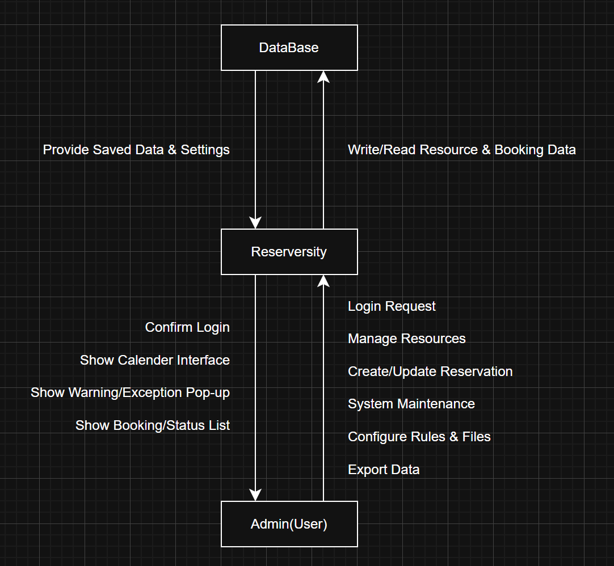

  <b>Project Name: Reserversity</b> 
  <b>Student NO.</b> 22212034 | <b>Name.</b> 최승표 
  <b>E-mail.</b> [cspcsp07@naver.com]

---

  <b>[ Revision History ]</b>
     

| Revision date | Version # | Description | Author |
| :---: | :---: | :---: | :---: |
| 03.27.2026 | 0.0.1 | First Document | 최승표 |

  

---

## = Contents =

1. Business Perpose 
2. System Context diagram 
3. Use case list 
4. Cocept of operation 
5. Problem statement 
6. Glossary 
7. References

---

 

# 1. Business purpose

### 1) Project background
대학교 학과 생활을 하다 보면, 전공 실습이나 프로젝트를 위해 자원(강의실 및 기자대)을 대여하는 일이 번번히 발생한다. 보통 이러한 자원 관리는 학과 사무실에서 담당하고있다. 그러나 이 프로젝트는 실제 근로 장학생으로 일하며 겪은 학과 사무실의 아날로그적인 관리 방식과 그로 인한 리스크에 주목하여 새로운 해결책을 모색하고자 한다.

**첫 번째, 수기 관리의 한계: 잦은 대관 문의 응대 피로와 휴먼 에러로 인한 이중 예약 리스크** 근로 장학생으로 근무하던 근로지에서는 강의실 대관 서비스를 수기 작성 및 엑셀 입력에 의존하고있었다. 대관 문의가 들어오면 근로 장학생들이 시간표와 대관 내역을 일일이 확인하여 대조해 보아야한다. 여기서 문제가 발생한다. 수동으로 관리하다 보니 엑셀에 입력을 깜빡하거나 저장이 되지 않아 이중 예약이 잡히는 경우가 생긴다. 빈번하지는 않더라도 한 번 겹체기 되면 서로 곤란해지는 상황이 발생하며, 잦은 문의에 일일이 응대해야 하는 업무 피로도 역시 상당하다.그래서 사전에 입력된 학교 시간표를 바탕으로 예약 가능한 빈 시간만 화면에 띄워주고, 충돌을 시스템적으로 막아주는 방식이 도입된다면 이 문제를 근본적으로 해결할 수 있을 것이라 생각했다.

**두 번째, 안전 관리의 사각지대: 분산된 관리 체계로 인한 통제 불능** 현재 학과 내 실습실과 특수 장비의 관리는 각각 별도의 종이 명부나 개별 엑셀 파일로 분산되어있다. 혹은 한 파일에 있더라도 한눈에 파악이 안되는 경우가 허다하다. 이처럼 관리 체계가 일원화되지 않아, 관리자가 특정 사용자의 안전교육 이수 여부를 실시간으로 대조하거나 무단 사용을 즉각적으로 적발하기 매우 어려운 구조적 한계가 존재한다.  
실제로 현장 점검 시 명부 미작성 인원이나 허가되지 않은 재료 사용자가 적발되는 등 안전사고 리스크가 상존하고 있다. 따라서 파현화된 자원 관리 프로세스를 하나의 시스템으로 통합하여 한눈에 파악할 수 있는 철저한 관리 체계 구축이 시급하다고 생각했다.

### 2) Goal
해당 프로젝트는 쉽고 편리한 사용법과 직관적인 UI를 제공하여 다양한 자원 관리를 통합하는 것을 목표로 한다.  
- 분산된 자원 관리의 일원화: 강의실 대관과 장비 대여를 하나의 대시보드에서 통합관리  
- 직관적인 현황 파악: 반응형 달력 인터페이스를 도입하여, 관리자가 별도의 대조 작업 없이 실시간 예약 현황을 한눈에 파악  
- 이중 예약 및 휴먼 에러 방지: 학과 시간표와 연동하여 예약 가능한 시간만 노출함으로써 시스템적으로 예약 충돌을 근본적으로 차단  
- 행정 업무의 효율성 제고: 수기 작성 및 개별 엑셀 입력의 번거로움을 줄이고, 데이터 기반의 체계적인 자원 운용 환경 구축  

### 3) Target Market
- 여러 자원의 대여 업무가 빈번하고, 수기 방식이나 개별 엑셀 파일 등 분산된 관리 방식으로 인해 데이터 정합성 유지와 실시간 현황 파악에 어려움을 느끼는 학과 사무실  
- 관리 행정 업무 효율을 높이고자 하는 교육 기관 등

---

 

# 2. System context diagram

  

### 2.1. Descroption for the terms in the diagram
- **Reserversity** 본 프로젝트의 개발 대상이 되는 핵심 개발자용 데스크톱 애플리케이션이다. 학과 사무실 내에서 구동되며 공간 대관, 장비 대여, 예외 처리 및 권한 관리 등 자원 관리에 필요한 모든 비즈니스 로직을 처리하는 중앙 시스템에다.
- **Admin(User)** 시스템을 직접 조작하는 주 사용자를 의미한다. 로그인 과정을 거쳐 시스템 대시보드에 접근하며, 자원 검색, 예약 입력, 권한 설정 등의 관리 업무를 수행한다.
- **DataBase** 시스템의 모든 예약 내역, 자원 정보, 관리자 설정값 등을 영구적으로 저장하는 로컬 데이터 저장소이다.

---

 

# 3. Use case list  

| No. | Actor | Description |
| :--- | :---: | :--- |
| **1. System setup** | Admin | 최초 실행 시, 시스템 보호를 위한 마스터 비밀번호를 생성하여 보안 환경을 구축한다. |
| **2. Login** | Admin | 설정된 비밀번호를 입력하여 접속한다. |
| **3. Resource Management** | Admin | 장소나 장비를 "자원"으로 등록하고, 독립된 탭을 생성하여 자원별로 화면을 분리 관리한다. |
| **4. Configure Resource Rules** | Admin | 자원별 운영 시간, 예약 규칙 및 관련 서류 데이터를 시스템에 설정한다. |
| **5. Register Reservation** | Admin | 이용자 정보 및 시간을 입력하고 신규 예약을 등록한다. |
| **6. Update Usage Status** | Admin | 달력 내 예약 리스트를 클릭하여 상태를 관리한다. |
| **7. Manage exceptionis** | Admin | 규정 위반 예약 시 경고를 출력하며, 필요에 따라 강제로 예약을 승인한다. |
| **8. System Maintenance & Backup** | Admin | 관리자 비밀번호를 변경하거나, 시스템 전체 데이터를 안전하게 백업한다. |
| **9. System Setting** | Admin | 특정 기간의 예약 내역을 추출하여 엑셀이나 워드 파일로 문서화 한다. |

---

 

# 4. Concept of operation

**1) Initialize Security Setup**
| | |
| :--- | :--- |
| **Purpose** | 프로그램 실행에 필요한 비밀번호를 생성한다. |
| **Approach** | 프로그램 설치 후 첫 실행 시 관리자 비밀번호를 입력받아, 이름 암호화된 로컬 설정 파일로 저장하여 시스템 접근 권한을 확정한다. |
| **Dynamics** | 관리자 정보(암호 파일)이 없는 상태에서 프로그램을 최초 구동할 경우 |
| **Goals** | 프로그램 실행 권한 보안 키를 구축한다. |

 

**2) Login**
| | |
| :--- | :--- |
| **Purpose** | 프로그램 사용을 위해 비밀번호를 입력한다. |
| **Approach** | 설정된 비밀번호를 입력하여 로그인을 진행한다. |
| **Dynamics** | 관리자 정보가 있는 상태에서 프로그램을 실행할 경우 |
| **Goals** | 프로그램 실행 권한 보안 키를 구축한다. |

 

**3) Resource Tab Switching**
| | |
| :--- | :--- |
| **Purpose** | 서로 다른 자원을 탭 단위로 분리하여 효율적으로 관리한다. |
| **Approach** | 상단에 위치한 자원별 탭을 클릭하여 해당 장비의 예약 현황판으로 이동한다. |
| **Dynamics** | 특정 자원에 대해 예약 현황을 확인하거나 관리할 경우 |
| **Goals** | 장비별 독립된 관리 화면을 제공하여 업무 효율을 높인다. |

 

**4) Create New Booking**
| | |
| :--- | :--- |
| **Purpose** | 예약을 관리하기 위한 새로운 자원 항목 생성 |
| **Approach** | 자원 관리 탭에서 관리할 자원의 이름, 이용 규칙 등을 설정한 후 새로운 예약 카테고리를 추가한다. |
| **Dynamics** | 특정한 자원에 대해 새로운 예약 탭을 생성할 경우 |
| **Goals** | 예약 정보를 추가하여, 자원의 초기 예약 시스템을 구축한다. |

 

**5) Configure Resource Settings & Data Storage**
| | |
| :--- | :--- |
| **Purpose** | 등록된 자원의 운영 시간 및 세부 관리 규칙 설정 자원 운영 규칙 설정 및 관련 참고 자료(파일) 보관 |
| **Approach** | 자원별 운영 시간과 규칙을 입력하고, 해당 자원 관리에 필요한 양식 파일이나 시간표 이미지 등을 업로드하여 보관한다. |
| **Dynamics** | 신규 자원 등록 후 세부 운영 가이드라인과 관련 서류를 연결할 경우 |
| **Goals** | 자원 운영에 필요한 모든 데이터와 파일을 한곳에 모아 관리 편의성을 높인다. |

 

**6) Create Reservation**
| | |
| :--- | :--- |
| **Purpose** | 설정된 규칙에 따른 예약 데이터를 등록한다. |
| **Approach** | 왼쪽 시간표 그리드에서 날짜 칸 내에 배치된 [+] 버튼을 클릭하면, 오른쪽에서 상세 예약 설정창에서 이용자 정보와 예약 세부 정보를 입력하여 확정한다. |
| **Dynamics** | 특정 자원에 대해 신규 예약 신청이 발생하여 정보를 입력할 경우 |
| **Goals** | 한 화면에서 현황 파악과 정보 입력을 동시에 수행한다. |

 

**7) Update Status & Reservaion Management**
| | |
| :--- | :--- |
| **Purpose** | 실제 자원의 사용 상태(대여 여부) 관리 및 예약 데이터 수정/삭제한다. |
| **Approach** | 달련 내 개별 예약 항목을 클릭하여 ‘대여 중’, ‘반납 완료’로 상태를 변경하거나, 예약 취소 및 데이터 삭제를 수행한다. |
| **Dynamics** | 이용자가 자원을 수령/반납하거나, 예약 정보를 수정할 경우 |
| **Goals** | 자원 사용의 전 과정을 관리한다. |

 

**8) Exception**
| | |
| :--- | :--- |
| **Purpose** | 설정에서 정한 룰에 위반하는 예약을 예외로 처리한다. |
| **Approach** | 시간표 및 다른 대관에 겹치거나, 사용 가능 시간을 넘어 사용하는 예약을 할 경우, 경고 메시지 창이 뜬 후 예외 예약을 설정한다. |
| **Dynamics** | 규칙 위반에 관한 예약을 할 경우 |
| **Goals** | 예약 시스템에 관한 변수를 관리자가 관리할 수 있다. |

 

**9) System Maintenance & Data Export**
| | |
| :--- | :--- |
| **Purpose** | 보안 설정 관리 및 기간별 데이터 외부 추출/백업 |
| **Approach** | 비밀번호를 변경하거나, 특정 기간을 설정하여 해당 범위 내의 예약 데이터를 외부 파일(엑셀, 워드) 파일로 추출 및 외부 장치에 백업한다. |
| **Dynamics** | 대여 현황에 대한 문서화가 필요하거나 보안 요소를 업데이트 할 경우 |
| **Goals** | 편리한 문서화와 안전한 데이터 관리를 가능하게 한다. |

---

 

# 5. Problem statement

### 5.1. Overview  
’YU-Reserve’는 학과 내 산재한 강의실 대관 및 기자재 대여 프로세스를 통합하여 실시간으로 모니터링하고 관리하는 것이 주 목적이다. 이 프로그램은 쉽고 편리하고 다양한 자원을 관리하는 것에 초점을 둔다. 본 시스템은 서버가 없는 로컬 환경에서도 데이터의 신뢰성을 유지하며, 쉽고 간편하게 즉시 업무에 투입될 수 있는 직관적인 인터페이스를 제공해야 한다.
- 자원 데이터의 무결성 및 보안 유지
- 달력 기반의 실시간 예약 현황 처리

### 5.2. Problem definition  
Reserve System 구축 과정에서 직면할 수 있는 문제점 및 해결 방법은 다음과 같다.

#### 5.2.1. Problem #1: Data Security in Local Environment  
본 프로그램은 서버 기반의 계정 관리를 하지 않으므로 데이터베이스 파일이 로컬 PC에 직접 저장된다. 이 경우 인가되지 않은 사용자가 데이터를 임의로 수정할 위험이 있다.
- **solution**: 프로그램 최초 실행 시 마스터 비밀번호를 설정하게 하여 이를 암호화된 설정 파일로 관리한다. 모든 데이터 접근은 이 인증 과정을 거쳐야마 활성화되도록 설계하여 보안성을 확보한다.

#### 5.2.2. Problem #2: Unified Resource Categorization  
서로 다른 자원은 서로 예약 단위와 관리 규칙이 상이하다. 이를 하나의 시스템으에 넣을 때 데이터 구조가 복잡해질 수 있는 문제가 있다.
- **solution**: 모든 관리 대상을 ‘Resource’라는 상위 개념으로 통합하되, 각 자원별로 독립적인 탭을 생성하여 관리한다. 자원 등록 시 각각의 특성은 개별 세팅할 수 있는 ‘세부 설정’기능을 통해 데이터 일관성을 유지한다.

#### 5.2.3. Problem #3: Intuitive Reservation UI  
단순 리스트 방식은 예약 밀집도를 한눈에 파악하기 어렵고, 관리자의 업무 피로도를 높인다. 특히 날짜와 시간을 동시에 고려해야 하는 예약 업무 특성상 UI 설계가 복잡해 질수 있다.
- **solution**: 메인 인터페이스를 반응형 달력으로 구성한다. 각 날짜 칸에 [+] 버튼을 배치하여 즉각적인 등록이 가능하게 하고, 등록된 예약은 리스트 및 시간표 형태로 노출하여 클릭 한 번으로 상태를 변경할 수 있다. 

#### 5.2.4. Problem #4: Data Continuity & Reporting  
로컬 하드웨어 장애 발생 시 모든 예약 이력이 손실될 우려가 있으며, 주기적인 자원 현황 보고를 위해 데이터를 수동으로 재가공해야 하는 번거로움이 있다.
- **Solution**: 시스템 내에 ‘백업 및 엑셀 추출’ 기능을 탑재한다. 특정 기간을 설정하여 데이터를 외부 파일로 즉시 내보낼 수 있게 함으로써 행정 업무 자동화와 데이터 안전성을 동시에 달성한다.

### 5.3. NFRs  
1) 프로그램 실행 시 메인 화면이 나타나는 시간은 2초 미만이어야 한다.
2) 자원별 탭 전환 시 지연시간은 0.5초 이내로 유지되어야 한다.
3) 모든 예약 데이터는 로컬 내 암호화된 형태로 저장되어야 한다.
4) 사용자 조작 실수를 방지하기 위해 예약, 삭제 및 상태 변경 전 확인 팝업을 출력한다.

---

 

# 6. Glossary

1) **Resource(자원)** 학과 내에서 관리의 대상이 되는 모든 유/무형의 항목을 의미한다. 강의실, 세니마실과 같은 ‘공간’과 3D프린터, 노트북, 카메라와 같은 ‘기자재’를 모두 포함하는 상위 개념이다.

2) **Admin(관리자/교직원)** 시스템의 모든 권한을 가진 사용자(주로 학과 교직원 및 근로 장학생)를 의미한다. 자원 등록, 예약 승인, 상태 변경 및 시스템 보안 설정을 수행한다.

3) **Master Password(마스터 비밀번호)** 시스템 실행 및 민감 데이터(예약 내역, 자원 설정 등)에 접근하기 위해 최초 설정하는 관리자 전용 암호를 의미한다.

4) **Verifier(확인자)** 특정 예약 건을 등록하거나 상태를 변경한 관리자의 실명을 의미한다. 모든 작업 로그에 확인자를 필수로 입력한다.

5) **Status(상태)** 개별 예약 건의 현재 진행 단계를 나타내며, ‘대기’, ‘대여중’, ‘반납 완료’, 취소‘ 등으로 구분된다.

6) **Exception Reservation(예외 예약)** 시스템 설정된 운영 규칙(수업 시간 중복, 이용 시간 초과 등)에 위배되지만, 관리자의 판단하에 강제로 등록된 특수 예약 건을 의미한다.

7) **Data Export(데이터 추출)** 시스템 내에 축적된 예약 및 자원 활용 데이터를 외부 문서 형식으로 변환하여 저장하는 기능을 의미한다.

8) **Local Database(로컬 데이터베이스)** 서버 없이 사용자 PC의 로컬 저장소에 파일 형태로 존재하는 데이터 저장 체계를 의미한다.

---

 

# 7. References

* 학과 사무실 대관 업무 프로세스(실제 근로 경험 기반)
* **Google Gemini 1.5 Pro** (Conceptual Logic Verification & Design Decision Support)
* **draw.io** (System Context Diagram & Use Case Diagram Visualization)

