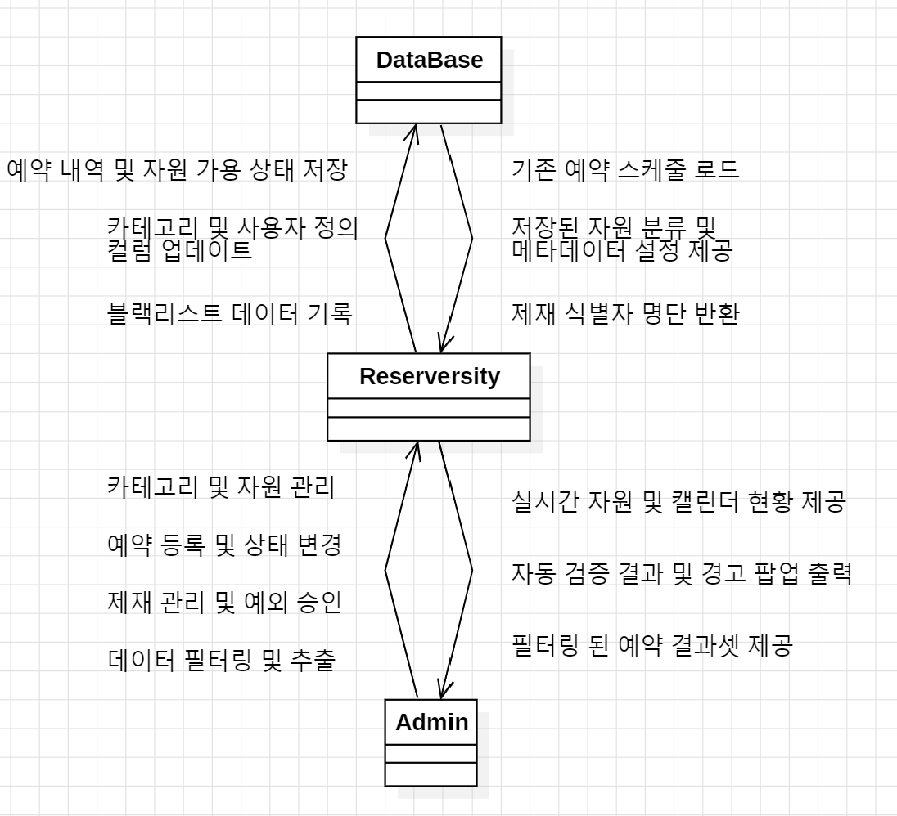

# Project Name: Reserversity
[ Student No ] 22212034  
[ name ] 최승표  
[ email ] cspcsp07@naver.com

---

### [ Revision history ]
| Revision date | Version # | Description | Author |
| :---: | :---: | :---: | :---: |
| 2026.03.27 | 0.0.1 | First Document | 최승표 |
| 2026.05.04 | 0.0.2 | 구조 변경 | 최승표 |
| 2026.06.03 | 0.0.3 | 예약자/승인자 용어 정리, 예약 관리 시나리오 및 개념 설명 보완 | 최승표 |

## [ Contents ]
1. Business Perpose 
2. System Context diagram 
3. Use case list 
4. Cocept of operation 
5. Problem statement 
6. Glossary 
7. References

## 1. Business purpose
### 1) Project background
대학교 학과 생활을 하다 보면, 전공 실습이나 프로젝트를 위해 자원(강의실 및 기자대)을 대여하는 일이 번번히 발생한다. 보통 이러한 자원 관리는 학과 사무실에서 담당하고있다. 그러나 이 프로젝트는 실제 근로 장학생으로 일하며 겪은 학과 사무실의 아날로그적인 관리 방식과 그로 인한 리스크에 주목하여 새로운 해결책을 모색하고자 한다.

**첫 번째, 수기 관리의 한계: 잦은 대관 문의 응대 피로와 휴먼 에러로 인한 이중 예약 리스크** 근로 장학생으로 근무하던 근로지에서는 강의실 대관 서비스를 수기 작성 및 엑셀 입력에 의존하고있었다. 대관 문의가 들어오면 근로 장학생들이 시간표와 대관 내역을 일일이 확인하여 대조해 보아야한다. 여기서 문제가 발생한다. 수동으로 관리하다 보니 엑셀에 입력을 깜빡하거나 저장이 되지 않아 이중 예약이 잡히는 경우가 생긴다. 빈번하지는 않더라도 한 번 겹체기 되면 서로 곤란해지는 상황이 발생하며, 잦은 문의에 일일이 응대해야 하는 업무 피로도 역시 상당하다.그래서 사전에 입력된 학교 시간표를 바탕으로 예약 가능한 빈 시간만 화면에 띄워주고, 충돌을 시스템적으로 막아주는 방식이 도입된다면 이 문제를 근본적으로 해결할 수 있을 것이라 생각했다.

**두 번째, 안전 관리의 사각지대: 분산된 관리 체계로 인한 통제 불능** 현재 학과 내 실습실과 특수 장비의 관리는 각각 별도의 종이 명부나 개별 엑셀 파일로 분산되어있다. 혹은 한 파일에 있더라도 한눈에 파악이 안되는 경우가 허다하다. 이처럼 관리 체계가 일원화되지 않아, 관리자가 특정 사용자의 안전교육 이수 여부를 실시간으로 대조하거나 무단 사용을 즉각적으로 적발하기 매우 어려운 구조적 한계가 존재한다.  
실제로 현장 점검 시 명부 미작성 인원이나 허가되지 않은 재료 사용자가 적발되는 등 안전사고 리스크가 상존하고 있다. 따라서 파현화된 자원 관리 프로세스를 하나의 시스템으로 통합하여 한눈에 파악할 수 있는 철저한 관리 체계 구축이 시급하다고 생각했다.

### 2) Goal
해당 프로젝트는 쉽고 편리한 사용법과 직관적인 UI를 제공하여 다양한 자원 관리를 통합하는 것을 목표로 한다.  
- 분산된 자원 관리의 일원화: 강의실 대관과 장비 대여를 하나의 대시보드에서 통합관리  
- 직관적인 현황 파악: 반응형 달력 인터페이스를 도입하여, 관리자가 별도의 대조 작업 없이 실시간 예약 현황을 한눈에 파악  
- 이중 예약 및 휴먼 에러 방지: 학과 시간표와 연동하여 예약 가능한 시간만 노출함으로써 시스템적으로 예약 충돌을 근본적으로 차단  
- 행정 업무의 효율성 제고: 수기 작성 및 개별 엑셀 입력의 번거로움을 줄이고, 데이터 기반의 체계적인 자원 운용 환경 구축  

### 3) Target Market
- 여러 자원의 대여 업무가 빈번하고, 수기 방식이나 개별 엑셀 파일 등 분산된 관리 방식으로 인해 데이터 정합성 유지와 실시간 현황 파악에 어려움을 느끼는 학과 사무실  
- 관리 행정 업무 효율을 높이고자 하는 교육 기관 등

## 2. System context diagram

  
  
<em>&lt;그림 1&gt; Use Case Diagram</em>

### 2.1. Descroption for the terms in the diagram
- **Reserversity** 본 프로젝트의 개발 대상이 되는 핵심 개발자용 데스크톱 애플리케이션이다. 학과 사무실 내에서 구동되며 공간 대관, 장비 대여, 예외 처리 및 권한 관리 등 자원 관리에 필요한 모든 비즈니스 로직을 처리하는 중앙 시스템에다.
- **Admin(User)** 시스템을 직접 조작하는 주 사용자를 의미한다. 로그인 과정을 거쳐 시스템 대시보드에 접근하며, 자원 검색, 예약 입력, 권한 설정 등의 관리 업무를 수행한다.
- **DataBase** 시스템의 모든 예약 내역, 자원 정보, 관리자 설정값 등을 영구적으로 저장하는 로컬 데이터 저장소이다.

## 3. Use case list  

| No. | Use Case | Actor | Description |
| :--- | :--- | :--- | :--- |
| 1 | 카테고리 관리 (CRUD) | Admin | 자원을 논리적으로 분류하는 최상위 탭(Category)을 생성, 수정 및 삭제한다. 단, 자원이 포함된 카테고리는 삭제가 제한된다. |
| 2 | 자원 관리 (CRUD) | Admin | 개별 자원(Resource)을 등록하고 가용 상태(수리/폐기 등)를 관리하며, 자원별 사용자 정의 컬럼(Metadata)을 설정한다. |
| 3 | 예약 관리 (CRUD) | Admin | 식별자(학번/사번)를 기반으로 신규 예약을 등록하고, 시간 충돌 및 자원 상태를 검증하며 승인 이력을 기록하고 기존 내역을 수정하거나 삭제한다. |
| 4 | 사용자 예약 권한 관리 | Admin | 규정 위반자의 식별자를 블랙리스트(Penalty)에 등록/해제하여 시스템적으로 예약을 차단하거나 관리자 직권으로 예외 승인을 수행한다. |
| 5 | 출력 및 필터링 | Admin | 기간, 자원, 식별자 등 다중 조건을 필터링하여 화면에 렌더링된 예약 결과셋을 외부 문서(Excel, PDF)로 추출한다. |

## 4. Concept of operation

**1) Immediate System Access & Initialization**
| | |
| :--- | :--- |
| **Purpose** | 번거로운 인증 절차 없이 시스템을 즉시 실행하여 관리 업무를 시작한다. |
| **Approach** | 계정 로그인이나 마스터 비밀번호 입력 없이, 애플리케이션 실행 즉시 메인 대시보드가 열리며 모든 관리 권한이 부여된다. 시스템 보안 및 접근 통제는 프로그램이 설치된 학과 사무실 PC의 물리적 보안에 위임한다. |
| **Dynamics** | 학과 사무실 관리자(근로 장학생 등)가 바쁜 현장에서 즉각적인 예약 응대 및 관리가 필요할 경우 |
| **Goals** | 불필요한 진입 장벽을 완전히 제거하여 가장 빠르고 직관적인 업무 개시 환경을 제공한다. |

 

**2) Category & Resource Setup**
| | |
| :--- | :--- |
| **Purpose** | 관리할 자원의 논리적 분류(카테고리)를 생성하고 개별 자원의 특성을 설정한다. |
| **Approach** | 대시보드에서 신규 카테고리(탭)를 추가하고 자원을 등록하며, 해당 자원만의 고유 속성 관리를 위해 사용자 정의 컬럼(Metadata)을 동적으로 구성한다. |
| **Dynamics** | 새로운 강의실이나 기자재가 학과에 도입되어 시스템에 신규 등록해야 할 경우 |
| **Goals** | 형태와 관리 방식이 다른 다양한 자원들을 하나의 시스템 내에서 유연하게 통합 관리한다. |

 

**3) Reservation Processing & Validation**
| | |
| :--- | :--- |
| **Purpose** | 예약자의 식별자를 기반으로 예약을 등록하고 시스템 규칙을 자동 검증하며, 승인 이력을 별도로 기록한다. |
| **Approach** | 캘린더 인터페이스에서 원하는 날짜/시간과 예약자 식별자를 입력하면, 시스템이 시간 충돌, 자원 가용 상태, 제재 여부를 자동으로 확인하여 예약을 대기 상태로 저장하고, 관리자가 승인할 때 승인자를 기록한다. |
| **Dynamics** | 이용자가 특정 자원에 대해 신규 예약을 요청하거나 기존 예약을 수정할 경우 |
| **Goals** | 3중 자동 검증(시간, 상태, 권한)과 승인자 기록을 통해 휴먼 에러와 이중 예약을 원천 차단한다. |

 

**4) Penalty & Exception Handling**
| | |
| :--- | :--- |
| **Purpose** | 규정 위반자 차단 및 관리자 직권에 의한 예외적 상황을 처리한다. |
| **Approach** | 제재 대상자(블랙리스트)의 예약 시도를 시스템적으로 차단하며, 필요한 경우 관리자가 직권으로 충돌이나 제재를 무시하고 예외 예약을 승인(Exception)한다. |
| **Dynamics** | 규정을 위반한 사용자의 예약 요청이 들어오거나, 특수한 행정적 사유로 규칙을 우회해야 할 경우 |
| **Goals** | 엄격한 시스템 규칙을 적용하되, 관리자의 유연한 현장 대응력을 보장한다. |

 

**5) Data Export & Maintenance**
| | |
| :--- | :--- |
| **Purpose** | 행정 증빙 및 데이터 백업을 위해 예약 내역을 문서화한다. |
| **Approach** | 시스템 내 필터링 기능(기간, 자원, 식별자 등)을 활용하여 원하는 데이터셋을 화면에 렌더링한 후, Excel이나 PDF 파일로 내보내기(Export)를 수행한다. |
| **Dynamics** | 학과 사무실의 주기적인 업무 보고, 실적 파악 또는 로컬 데이터의 안전한 보관이 필요할 경우 |
| **Goals** | 시스템에 축적된 데이터를 외부 문서로 쉽게 전환하여 행정 업무 효율을 극대화한다. |

## 5. Problem statement
### 5.1. Overview 
'Reserversity'는 학과 내 산재한 강의실 대관 및 기자재 대여 프로세스를 통합하여 실시간으로 모니터링하고 관리하는 것이 주 목적이다. 본 시스템은 서버가 없는 로컬 환경에서도 데이터의 신뢰성을 유지하며, 별도의 학습 없이 즉시 업무에 투입될 수 있는 직관적인 인터페이스를 제공해야 한다.
- 로컬 환경에서의 데이터 무결성 및 보안 유지
- 반응형 달력 기반의 실시간 예약 현황 처리 및 자동 검증

### 5.2. Problem definition 
시스템 구축 과정에서 직면할 수 있는 문제점 및 해결 방법은 다음과 같다.

#### 5.2.1. Problem #1: Administrative Friction in Fast-paced Environment 
바쁜 학과 사무실 현장에서는 대관 문의에 즉각적으로 응대해야 하나, 기존 웹 기반 시스템이나 사내 인트라넷은 로그인 및 인증 절차를 요구하여 업무의 흐름을 끊고 응대 지연을 유발한다.
- **Solution**: 시스템 진입 시 요구되는 로그인이나 비밀번호 입력 과정을 전면 폐지한다. 프로그램 실행 즉시 모든 기능을 사용할 수 있는 'Zero-Depth' 접근 방식을 채택하여 행정 마찰(Friction)을 없앤다. 데이터 무단 접근에 대한 보안은 해당 소프트웨어가 구동되는 사무실 내 인가된 PC의 물리적 환경 및 OS 접근 통제에 일임한다.

#### 5.2.2. Problem #2: Unified Resource Categorization 
강의실, 노트북, 전공 도서 등 서로 다른 자원은 관리 규칙과 필요로 하는 정보(예: 노트북의 OS, 도서의 출판사)가 상이하다. 이를 하나의 시스템에 넣을 때 데이터 구조가 복잡해지거나 확장이 어려워질 수 있다.
- **Solution**: 모든 관리 대상을 ‘Resource’라는 상위 개념으로 통합하되, 각 자원별로 독립적인 탭(Category)을 생성하여 관리한다. 자원 등록 시 관리자가 직접 **사용자 정의 컬럼(Metadata)**을 추가할 수 있게 하여 데이터의 일관성과 유연성을 유지한다.

#### 5.2.3. Problem #3: Human Error & Time Conflicts 
수기 관리나 단순 리스트 방식은 예약 밀집도를 파악하기 어렵고, 관리자의 실수로 인한 이중 예약이나 규정 위반자(노쇼 등)의 재예약을 방지하기 어렵다.
- **Solution**: 메인 인터페이스를 반응형 달력으로 구성하여 직관성을 높인다. 예약을 등록할 때 예약자의 **고유 식별자(학번/사번)**를 입력받아, 시스템이 1) 시간 충돌 2) 자원 상태 3) 블랙리스트(제재) 여부를 자동으로 검증하여 휴먼 에러를 시스템적으로 차단한다.

#### 5.2.4. Problem #4: Data Continuity & Reporting 
로컬 하드웨어 장애 발생 시 모든 예약 이력이 손실될 우려가 있으며, 주기적인 자원 현황 보고를 위해 데이터를 수동으로 엑셀 등에 다시 옮겨 적어야 하는 행정적 번거로움이 있다.
- **Solution**: 시스템 내에 ‘데이터 내보내기(Export)’ 기능을 탑재한다. 특정 기간, 자원, 식별자 등의 조건으로 필터링된 데이터를 엑셀(Excel) 또는 PDF 파일로 즉시 추출할 수 있게 함으로써 행정 업무를 자동화하고 백업의 용이성을 제공한다.

### 5.3. NFRs (Non-Functional Requirements)
1) **Performance**: 프로그램 실행 즉시 대시보드가 렌더링되어야 하며, 초기 구동 시간은 2초 미만, 자원별 탭 전환 시 지연시간은 0.5초 이내로 유지되어야 한다.
2) **Usability**: 사용자 조작 실수를 방지하기 위해 데이터 삭제 및 상태 변경 전 반드시 재확인 팝업을 출력해야 하며, 예외 예약(Exception) 진행 시 경고 메시지를 명확히 표시해야 한다.

# 6. Glossary

1. **Reserversity**  본 프로젝트를 통해 개발되는 학과 자원 예약 관리 시스템의 이름. 

2. **카테고리 (Category)**  자원을 논리적으로 분류하는 최상위 그룹. (예: 강의실, 실습장비, 도서 등) 

3. **자원 (Resource)**  예약 및 대여의 대상이 되는 개별 항목. 각 자원은 반드시 하나의 카테고리에 귀속됨. 

4. **예약 (Reservation)**  특정 예약자(식별자)와 자원을 특정 시간대에 연결하고, 승인자 이력을 함께 남기는 핵심 트랜잭션. 

5. **사용자 정의 컬럼 (Metadata)**  자원의 특성에 따라 관리자가 동적으로 추가할 수 있는 커스텀 속성 필드. 

6. **블랙리스트 (Penalty)**  규정 위반 이력이 있는 사용자의 식별자(학번/사번)를 등록하여 예약 권한을 제한하는 시스템적 제재 조치. 

7. **출력/내보내기 (Export)**  필터링된 예약 내역을 Excel이나 PDF 등의 파일 형태로 변환하여 로컬 하드디스크에 저장하는 행위. 

8. **대시보드 (Dashboard)**  자원 및 예약 현황을 한눈에 파악하고, 주요 관리를 수행하는 메인 화면. 

9. **승인자 (Approver)**  예약 건을 승인한 사용자로, 예약 승인 시 반드시 기록되어야 하는 식별자이다. 

# 7. References

* 학과 사무실 대관 업무 프로세스(실제 근로 경험 기반)
* **Google Gemini 1.5 Pro** (개념적 로직 검증 및 설계 의사결정 지원)
* **star uml** (시스템 컨텍스트 다이어그램 및 유스케이스 다이어그램 시각화)
